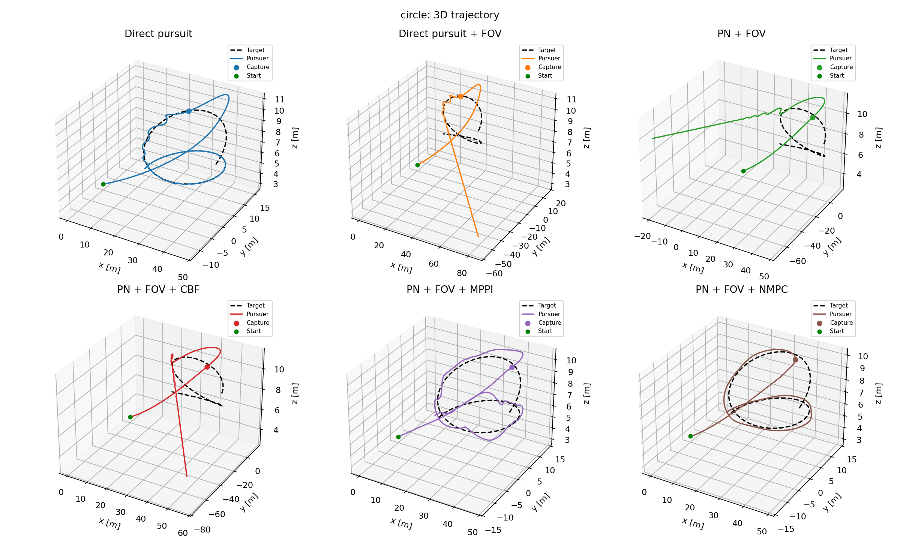
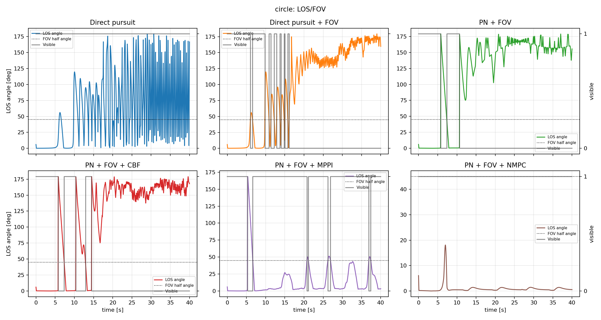
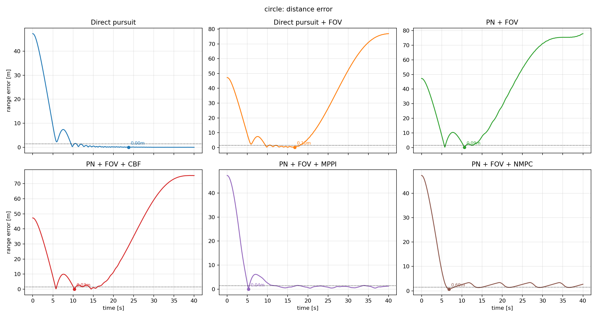
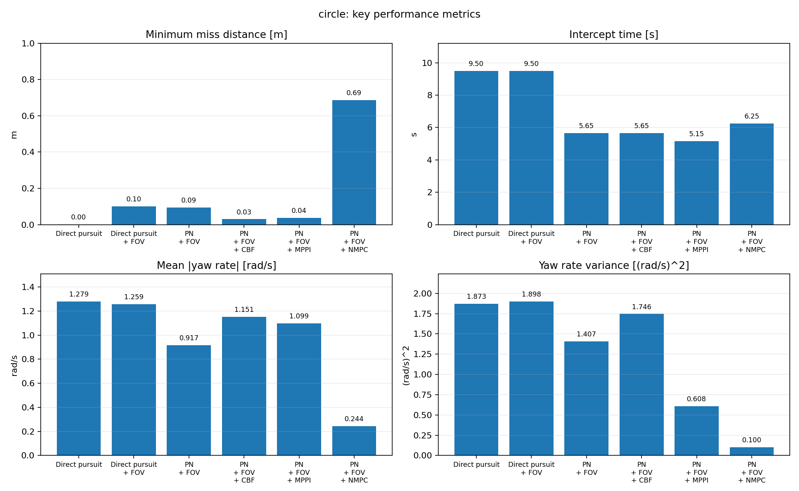
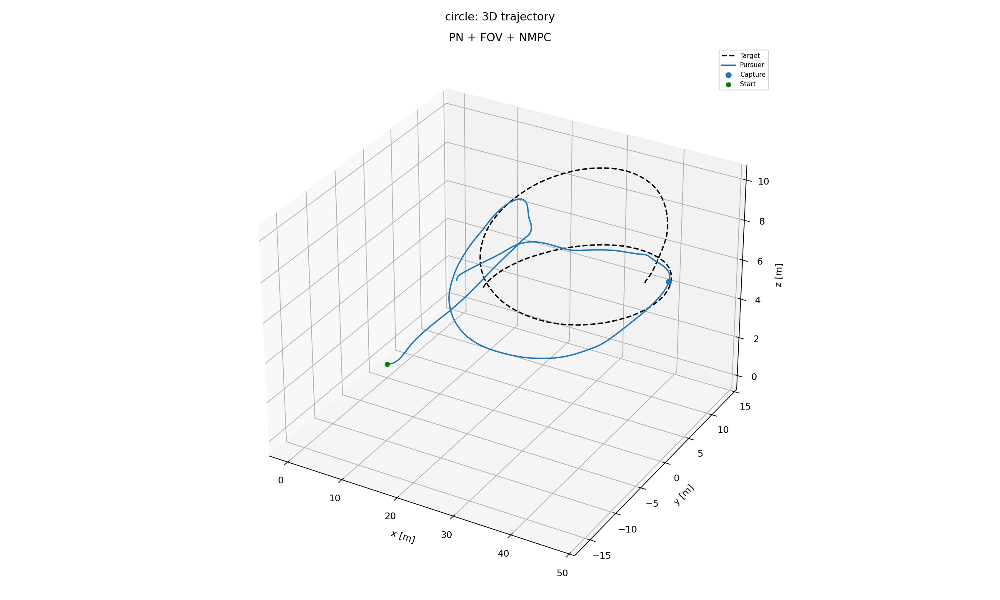
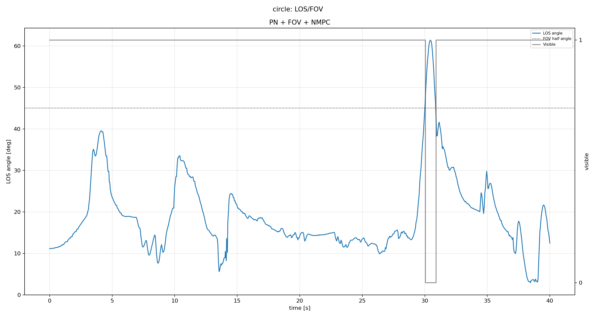
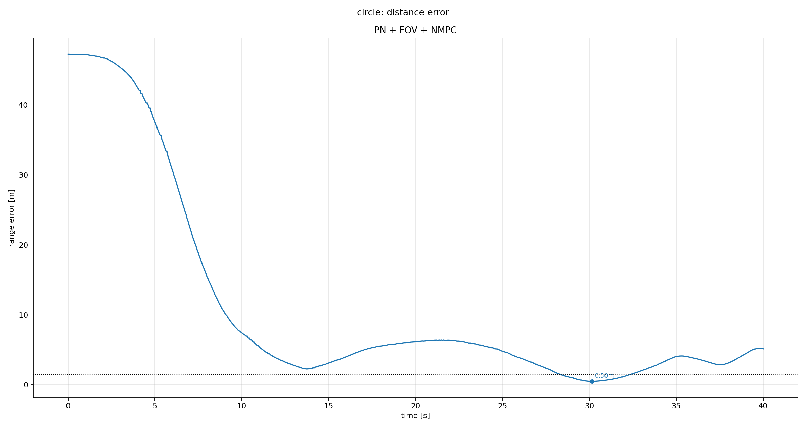

# 无人机有限视场目标追踪仿真系统介绍

## 1. 仿真目的与验证思路

本文提出的核心算法为 **PN + FOV + NMPC**（比例导引 + 有限视场 + 非线性模型预测控制），其余算法作为对比基线。仿真目的不是建立高保真四旋翼气动模型，而是验证导引与视场约束处理方法的有效性。

仿真采用两级验证框架：

- **离线 Python 三维质点仿真**：用于在严格相同初始条件、目标轨迹和物理约束下进行多算法横向对比。
- **ROS2/PX4/Gazebo 双机闭环仿真**：用于验证算法通过 PX4 Offboard 接口接入实际飞控仿真链路后的可执行性。

关注的性能指标包括：捕获时间、最小距离、目标可见率、视场丢失时长、控制能量和 yaw 角速度平滑性。

## 2. 仿真系统总体结构

仿真代码组织在 `6_Simulation/src/` 下，分为两个主要模块。

### 2.1 离线 Python 仿真模块

路径：`src/pythonsimulation/`

| 文件 | 功能 |
| --- | --- |
| `config.py` | 定义算法名称、目标场景和统一仿真参数 |
| `state.py` | 定义追踪机/目标状态和仿真结果数据结构 |
| `target.py` | 生成静止、直线和圆周三类目标轨迹 |
| `dynamics.py` | 实现追踪机三维质点运动模型和 yaw/pitch 朝向更新 |
| `guidance.py` | 实现 Direct pursuit、Direct pursuit + FOV、PN + FOV、PN + FOV + CBF、PN + FOV + MPPI、PN + FOV + NMPC |
| `simulation.py` | 统一仿真循环，保证各算法在相同条件下运行 |
| `metrics.py` | 性能指标计算 |
| `plotting.py` | 图表生成 |
| `replay.py` | 导出 Foxglove/MCAP 回放文件 |

### 2.2 ROS2/PX4/Gazebo 闭环仿真模块

路径：`src/gazebosimulation/` 与 `src/px4_msgs/`

- `gazebosimulation` 是 ROS2 Python 包，将离线导引算法接入 PX4/Gazebo 双机仿真。
- `guidance_node.py` 控制两架 PX4 实例（`/px4_1` 为追踪机，`/px4_2` 为目标机）。
- 节点订阅两机 `VehicleOdometry`，发布 `OffboardControlMode`、`TrajectorySetpoint` 和 `VehicleCommand`。
- 目标机跟随 `target_state()` 生成的参考轨迹；追踪机使用目标机真实 PX4 odometry 作为闭环导引输入。
- `px4_msgs` 提供 PX4 uORB 消息在 ROS2 中的接口定义。
- Gazebo 仿真结果保存为 `outputs/gazebo/<scenario>/<algorithm>/gazebo_samples.csv`，再由 `plot_gazebo_csv.py` 后处理。

## 3. 坐标系与状态变量定义

### 3.1 离线仿真坐标系

离线算法统一使用 **ENU 坐标系**：

| 轴向 | 指向 |
| --- | --- |
| x | East（东） |
| y | North（北） |
| z | Up（天） |

追踪机状态：位置 `p_p`、速度 `v_p`、加速度 `a_p`、yaw、pitch。

目标状态：位置 `p_t`、速度 `v_t`、加速度 `a_t`。

yaw 表示水平朝向，yaw=0 指向 ENU 的 `+x` 方向。pitch 表示俯仰角，pitch=0 水平向前，正值向上。

### 3.2 Gazebo/PX4 坐标转换

PX4 使用 NED 坐标系，算法内部保持 ENU 坐标系，仅 ROS2/PX4 接口边界执行转换：

- 位置/速度/加速度：`[x_E, y_N, z_U] -> [y_N, x_E, -z_U]`
- yaw 角：`yaw_ned = pi/2 - yaw_enu`

这种设计避免维护两套算法实现，降低 Gazebo 与离线仿真之间的不一致风险。

## 4. 追踪机运动模型与物理约束

### 4.1 三维质点模型

导引算法输出加速度指令 `a_cmd`，经限幅后离散积分更新速度和位置：

```text
a_k = sat(a_cmd, a_max)
v_{k+1} = sat(v_k + a_k * dt, v_max)
p_{k+1} = p_k + v_{k+1} * dt
```

- 速度限幅保证 `||v|| <= v_max`
- 高度限制在 `[z_min, z_max]` 范围内

### 4.2 机头/相机朝向模型

yaw/pitch 用于建模有限视场方向，而非完整姿态动力学。每个仿真步中，追踪机朝向以最大 yaw/pitch 角速度逐渐转向 `look_at_position`：

- 无 FOV 限制算法：直接指向真实目标位置。
- 有 FOV 算法：目标可见时指向深度相机量测经 α-β 滤波后的估计点，目标丢失后指向滤波器常速度预测点。

### 4.3 默认仿真参数

| 参数 | 数值 | 含义 |
| --- | ---: | --- |
| `dt` | 0.05 s | 主仿真步长 |
| `sim_time` | 40 s | 单次仿真时长 |
| `capture_radius` | 1.5 m | 捕获判定半径 |
| `v_max` | 12 m/s | 追踪机最大速度 |
| `a_max` | 6 m/s^2 | 追踪机最大加速度 |
| `yaw_rate_max` | 90 deg/s | 最大 yaw 角速度 |
| `pitch_rate_max` | 60 deg/s | 最大 pitch 角速度 |
| `z_min` / `z_max` | 0.5 / 30 m | 高度范围 |
| `FOV` | 90 deg | 总视场角 |
| `FOV half angle` | 45 deg | 可见性判定半角 |

## 5. 目标运动场景设计

### 5.1 静止目标场景

- 目标固定在 `[40, 20, 8] m`
- 验证算法最基本的收敛能力
- FOV 算法在该场景中主要体现视场保持与控制平滑性差异

### 5.2 匀速直线目标场景

- 初始位置 `[25, -20, 8] m`，速度 `[2, 1, 0.2] m/s`
- 验证算法处理目标速度的能力
- 适合比较 Direct pursuit 与 PN + FOV/NMPC 在捕获时间和平均距离上的差异

### 5.3 圆周机动目标场景

- 圆心 `[35, 0, 8] m`，半径 12 m，角速度 0.25 rad/s，高度叠加正弦变化
- 持续改变 LOS 方向，是有限视场追踪中最具挑战性的测试
- 突出 `PN + FOV + NMPC` 算法优势的重点分析场景

## 6. 有限视场可见性模型

### 6.1 前向向量与 LOS 夹角

追踪机前向向量由 yaw 和 pitch 决定：

```text
f(yaw, pitch) = [cos(pitch)cos(yaw), cos(pitch)sin(yaw), sin(pitch)]^T
theta_LOS = arccos( f^T (p_t - p_p) / ||p_t - p_p|| )
visible = theta_LOS <= theta_FOV / 2
```

当 LOS 夹角小于等于半视场角时，目标被认为可见。

### 6.2 深度相机量测、α-β 滤波与目标丢失预测

- 目标可见时：由理想深度相机输出目标中心在机体/相机系下的三维点，再转换到地面系位置量测。
- 地面系位置量测进入 α-β 滤波器，估计目标位置和速度，作为 FOV 类算法的目标参考。
- 目标不可见时：不再访问真实目标状态，仅使用滤波器状态做常速度预测。
- 初始不可见且滤波器未初始化时：FOV 类算法返回零加速度，并让机头指向前方搜索点。
- 丢失目标时导引增益乘以 `lost_guidance_gain = 0.55`。

## 7. 对比算法设置

| 算法名称 | 角色 | 主要功能 |
| --- | --- | --- |
| Direct pursuit | 基线算法 | 速度方向始终指向真实目标当前位置 |
| Direct pursuit + FOV | 视场约束基线 | 使用深度相机量测/滤波估计目标，再执行直接追踪 |
| PN + FOV | 视场约束比例导引 | 使用深度相机量测/滤波估计目标，再执行三维比例导引 |
| PN + FOV + CBF | 安全滤波对比 | 接近 FOV 边界时加入侧向修正 |
| PN + FOV + MPPI | 采样预测控制对比 | 随机采样控制序列并按代价加权 |
| PN + FOV + NMPC | **本文重点算法** | 在 PN 趋势附近滚动优化候选控制 |

### 7.1 Direct pursuit

计算追踪机到目标当前位置的单位方向，设定期望巡航速度，通过一阶速度跟踪得到加速度指令。优点是简单稳定，缺点是不能预测目标未来运动。

### 7.2 Direct pursuit + FOV

在 Direct pursuit 基础上加入有限视场和传感器估计约束。目标可见时使用深度相机量测经 α-β 滤波得到的目标参考；目标不可见时使用滤波器常速度预测，并降低导引增益。该算法用于分离“直接追踪策略”和“有限视场传感器约束”的影响。

### 7.3 PN + FOV

在 PN 基础上加入有限视场判断和传感器估计。目标可见时使用深度相机位置量测与 α-β 滤波得到的目标参考；丢失时使用滤波器常速度预测并降低导引增益。是后续 CBF、MPPI、NMPC 的共同基线。

### 7.4 PN + FOV + CBF

在 PN 名义控制上叠加 FOV 安全修正。当 LOS 角接近半视场角边界时，沿横向误差方向加入加速度修正。在边界附近混入速度匹配项。

### 7.5 PN + FOV + MPPI

以 PN 加速度为名义控制序列，在预测窗口内采样多条带噪声的加速度序列，进行批量前向仿真并计算综合代价，根据代价指数权重融合第一步控制。

### 7.6 PN + FOV + NMPC（重点）

- 首先计算 PN 名义控制 `a_PN`
- 构造一组候选加速度（原始 PN、缩放 PN、直接拦截项、同速接近项、速度匹配项、LOS 垂直方向扰动项）
- 对每个候选加速度，在预测窗口内使用相同动力学前向滚动
- 预测目标位置仅使用当前参考目标位置和速度进行匀速外推
- 选择综合代价最低的候选作为当前控制，形成滚动优化

**关键特征**：轻量 shooting-based candidate optimization，不依赖 CasADi/acados 等外部求解器；候选由导引几何和任务意图构造，可解释性强；在预测窗口内同时考虑捕获、视场和控制平滑。

## 8. NMPC 代价函数设计

```text
J = w_d * J_terminal + w_p * J_path + w_f * J_fov + w_u * J_control + w_s * J_smooth + w_n * J_pn
```

| 权重 | 数值 | 含义 |
| --- | ---: | --- |
| `nmpc_w_dist` | 12.0 | 终端距离权重 |
| `nmpc_w_path` | 0.1 | 路径距离权重 |
| `nmpc_w_fov` | 10.0 | FOV 违反权重 |
| `nmpc_w_control` | 0.015 | 控制能量权重 |
| `nmpc_w_smooth` | 0.08 | 控制平滑权重 |
| `nmpc_w_pn` | 0.04 | 偏离 PN 趋势权重 |

| 参数 | 数值 | 含义 |
| --- | ---: | --- |
| `horizon_steps` | 20 | 预测步数 |
| `mpc_dt` | 0.1 s | 预测步长 |
| 预测时域 | 2.0 s | `horizon_steps * mpc_dt` |

## 9. 性能评价指标

| 指标 | 含义 | 评价方向 |
| --- | --- | --- |
| `capture_time` | 第一次进入捕获半径的时间 | 越小越好 |
| `min_distance` | 仿真过程中的最小相对距离 | 越小越好 |
| `mean_distance` | 平均相对距离 | 越小越好 |
| `path_length` | 追踪机轨迹长度 | 越短越经济 |
| `control_energy` | `sum(||a||^2 * dt)` | 越小越省 |
| `lost_duration` | 目标不在视场内的累计时间 | 越小越好 |
| `visible_ratio` | 目标可见时间占比 | 越大越好 |
| `yaw_rate_mean` | 平均 yaw 角速度绝对值 | 越小越平滑 |
| `yaw_rate_variance` | yaw 角速度方差 | 越小越平滑 |

**注意**：Direct pursuit 按理想传感器处理（`visible_ratio=1`），其视场指标不能直接与 FOV 算法在同一传感器条件下比较；`Direct pursuit + FOV`、`PN + FOV`、CBF、MPPI 和 NMPC 均使用有限视场量测/滤波参考。

## 10. 离线 Python 仿真流程

使用 `main.py` 运行三种场景下的全部算法：

```bash
cd 6_Simulation
uv run python main.py --scenario all --export-mcap
```

每个场景中，六种算法使用相同初始状态、相同目标轨迹和相同约束。仿真循环：生成目标状态 -> 计算导引加速度 -> 记录状态 -> 积分到下一步。

输出文件：

| 文件 | 内容 |
| --- | --- |
| `metrics.csv` | 各算法指标汇总 |
| `trajectory_3d.png` | 三维轨迹图 |
| `trajectory_xy.png` / `trajectory_xz.png` | 平面轨迹投影 |
| `distance_error.png` | 距离误差变化 |
| `fov_visibility.png` | FOV 可见性与 LOS 角 |
| `acceleration.png` | 加速度指令 |
| `yaw_rate.png` | yaw 角速度 |
| `metrics.png` | 指标柱状图 |
| `replay.mcap` | Foxglove 回放文件 |

## 11. 离线仿真结果分析

### 11.1 静止目标场景

| 算法 | 捕获时间/s | 最小距离/m | 控制能量 | 丢失时长/s | 可见率 | yaw rate mean/rad/s |
| --- | ---: | ---: | ---: | ---: | ---: | ---: |
| Direct pursuit | 6.35 | 0.0008 | 1196.61 | 0.00 | 1.000 | 1.296 |
| Direct pursuit + FOV | 6.35 | 0.0000 | 1045.84 | 30.05 | 0.250 | 1.288 |
| PN + FOV | 6.45 | 0.0005 | 747.15 | 30.20 | 0.246 | 1.274 |
| PN + FOV + CBF | 6.45 | 0.0007 | 1000.02 | 25.90 | 0.353 | 1.268 |
| PN + FOV + MPPI | 5.65 | 0.0162 | 445.51 | 2.55 | 0.936 | 1.230 |
| **PN + FOV + NMPC** | 7.55 | 0.8771 | **62.65** | **0.00** | **1.000** | **0.015** |

NMPC 在静止目标场景中不再追求最快捕获，而是显著降低控制强度和机头转动：控制能量最低（62.65），目标全程保持可见（可见率 1.000，丢失时长 0.00 s），yaw 角速度最平滑（0.015 rad/s）。其捕获时间为 7.55 s，说明当前参数更偏向视场保持与平滑控制。

### 11.2 匀速直线目标场景

| 算法 | 捕获时间/s | 最小距离/m | 控制能量 | 丢失时长/s | 可见率 | yaw rate mean/rad/s |
| --- | ---: | ---: | ---: | ---: | ---: | ---: |
| Direct pursuit | 6.00 | 0.0006 | 1247.86 | 0.00 | 1.000 | 1.366 |
| Direct pursuit + FOV | 6.00 | 0.0032 | 1128.75 | 23.85 | 0.404 | 1.365 |
| PN + FOV | 5.75 | 0.0009 | 917.18 | 24.70 | 0.383 | 1.322 |
| PN + FOV + CBF | 5.75 | 0.0013 | 1099.48 | 25.20 | 0.371 | 1.291 |
| PN + FOV + MPPI | 5.25 | 0.0683 | 428.67 | 1.15 | 0.971 | 1.333 |
| **PN + FOV + NMPC** | 6.15 | 0.4952 | **53.58** | **0.00** | **1.000** | **0.070** |

NMPC 在直线运动目标下实现了全程可见（可见率 1.000，丢失时长 0.00 s），控制能量最低（53.58），yaw 角速度最平滑（0.070 rad/s）。其捕获时间为 6.15 s，慢于 MPPI 和 PN + FOV，体现出以视场保持和低控制能量换取更保守接近过程的特点。

### 11.3 圆周机动目标场景

| 算法 | 捕获时间/s | 最小距离/m | 控制能量 | 丢失时长/s | 可见率 | yaw rate mean/rad/s |
| --- | ---: | ---: | ---: | ---: | ---: | ---: |
| Direct pursuit | 9.50 | 0.0018 | 1217.90 | 0.00 | 1.000 | 1.279 |
| Direct pursuit + FOV | 9.50 | 0.1016 | 913.59 | 28.75 | 0.282 | 1.259 |
| PN + FOV | 5.65 | 0.0938 | 639.58 | 30.95 | 0.227 | 0.917 |
| PN + FOV + CBF | 5.65 | 0.0303 | 860.86 | 29.65 | 0.260 | 1.151 |
| PN + FOV + MPPI | 5.15 | 0.0374 | 439.21 | 2.85 | 0.929 | 1.099 |
| **PN + FOV + NMPC** | 6.25 | 0.6859 | **126.00** | **0.00** | **1.000** | **0.244** |

圆周场景是最具挑战性的测试。NMPC 在该场景中实现全程可见（可见率 1.000，丢失时长 0.00 s），控制能量 126.00 远低于 MPPI 的 439.21，yaw 角速度均值也降至 0.244 rad/s。相应代价是捕获时间为 6.25 s，慢于 MPPI 的 5.15 s，且最小距离不如 PN + FOV/MPPI 激进拦截方案。






### 11.4 离线仿真综合结论

- **Direct pursuit**：简单稳定，但面对机动目标捕获效率低，且按理想传感器处理。
- **Direct pursuit + FOV**：加入有限视场量测与滤波后仍可捕获，但容易长时间失锁。
- **PN + FOV**：提高了拦截效率，但单纯 PN 在有限视场下仍容易长时间失锁。
- **CBF**：能一定程度调整 FOV 边界附近控制，但对复杂机动改善有限。
- **MPPI**：能显著提高可见率并保持较快捕获，但控制能量和 yaw 平滑性不如 NMPC。
- **PN + FOV + NMPC**：在三种场景中均实现 FOV 算法中的最高视场保持能力（当前输出中可见率均为 1.000、丢失时长均为 0.00 s），同时控制能量和 yaw rate 最低；代价是捕获过程更保守，捕获时间和最小距离不一定优于 PN + FOV/MPPI。

## 12. ROS2/PX4/Gazebo 闭环仿真设计

### 12.1 双机仿真结构

系统包含一架追踪机和一架目标机。目标机按合成目标轨迹飞行，追踪机通过 PX4 Offboard 模式接收速度和加速度 setpoint。两机均由 PX4 SITL 管理底层控制，ROS2 节点只负责导引计算、坐标转换、setpoint 发布和数据记录。

### 12.2 ROS2 话题与 PX4 消息

**订阅**：
- `/<pursuer>/fmu/out/vehicle_odometry`
- `/<target>/fmu/out/vehicle_odometry`

**发布**：
- `/<pursuer>/fmu/in/offboard_control_mode`
- `/<pursuer>/fmu/in/trajectory_setpoint`
- `/<pursuer>/fmu/in/vehicle_command`
- `/<target>/fmu/in/offboard_control_mode`
- `/<target>/fmu/in/trajectory_setpoint`
- `/<target>/fmu/in/vehicle_command`

### 12.3 启动与控制流程

1. 等待两机均发布有效 `VehicleOdometry`
2. 控制目标机进入 Offboard，飞到目标初始点
3. 目标机到达后，追踪机开始 Offboard 预热、解锁
4. 两机准备完成，仿真计时开始
5. 目标机持续发布轨迹 setpoint
6. 追踪机每周期读取目标机 odometry，调用 `compute_guidance()` 计算导引加速度
7. 加速度指令积分为速度 setpoint，同时发布速度和加速度控制

### 12.4 Gazebo 数据记录

节点退出时保存 `gazebo_samples.csv`，字段包括两机位置速度、加速度指令、yaw、pitch、距离、visible 和 LOS 角。后处理脚本 `plot_gazebo_csv.py` 复用离线仿真的指标计算和绘图函数。

## 13. Gazebo 闭环仿真结果分析

### 13.1 圆周场景 Gazebo 结果

| 算法 | 捕获时间/s | 最小距离/m | 控制能量 | 丢失时长/s | 可见率 | yaw rate mean/rad/s |
| --- | ---: | ---: | ---: | ---: | ---: | ---: |
| Direct pursuit | 12.95 | 0.1628 | 1239.76 | 0.00 | 1.000 | 1.258 |
| Direct pursuit + FOV | 13.60 | 0.3014 | 820.74 | 15.85 | 0.600 | 0.791 |
| PN + FOV | 10.30 | 0.0278 | 837.51 | 24.35 | 0.392 | 0.861 |
| PN + FOV + CBF | 10.09 | 0.0243 | 1043.11 | 14.25 | 0.645 | 1.034 |
| PN + FOV + MPPI | 10.80 | 0.1408 | 601.44 | 4.40 | 0.890 | 0.464 |
| PN + FOV + NMPC | 28.35 | 0.5030 | 435.33 | 0.85 | 0.979 | 0.268 |





### 13.2 分析

Gazebo 结果与离线仿真趋势不完全相同，因为 PX4 底层控制器和实际闭环动态引入额外影响：

- Direct pursuit 在 Gazebo 中捕获时间慢于离线仿真，说明真实飞控闭环引入了动态滞后。
- Direct pursuit + FOV 与 PN + FOV 均会出现较长失锁，其中 PN + FOV 丢失时长为 24.35 s，可见率为 0.392。
- CBF 在该 Gazebo 场景中将可见率提高到 0.645，但控制能量和 yaw 角速度仍较高。
- MPPI 丢失时长降至 4.40 s，可见率提高到 0.890。
- **NMPC 在受 FOV 约束算法中可见率最高（0.979），丢失时长最低（0.85 s），控制能量最低（435.33），yaw rate mean 最低（0.268 rad/s）**，表现出较强的视场保持和控制平滑性。
- NMPC 在 Gazebo 中可进入 1.5 m 捕获半径，捕获时间为 28.35 s，最小距离约 0.50 m；相较 MPPI，其视场保持、控制能量和 yaw 平滑性更好，但捕获时间更长。

## 14. 仿真假设与局限性

- 离线仿真采用三维质点模型，不包含完整四旋翼姿态、推力、电机和气动模型。
- yaw/pitch 主要用于有限视场判断，不是完整六自由度姿态动力学。
- FOV 可见性只考虑几何夹角，没有模拟图像噪声、遮挡、检测延迟和误检漏检。
- 目标丢失后的预测采用匀速模型，不能覆盖目标强机动或复杂行为。
- Gazebo 结果受 PX4 控制器参数、机体模型、目标机跟踪误差和通信频率影响。

## 15. 章节推荐结构

```
X 仿真验证与结果分析
X.1 仿真平台与总体框架
X.2 运动模型、视场模型与目标场景
X.3 对比算法与评价指标
X.4 离线数值仿真结果与分析
  X.4.1 静止目标场景
  X.4.2 匀速直线目标场景
  X.4.3 圆周机动目标场景
  X.4.4 离线仿真综合分析
X.5 PX4/Gazebo 闭环仿真结果与分析
X.6 仿真结论与局限性
```
