# 二维定高目标追踪仿真系统与算法框架说明

## 1. 仿真目的与验证思路

`7_2Dsimulation` 是面向无人机目标追踪问题的 **二维定高俯瞰仿真**。与 `6_Simulation` 中的三维有限视场仿真不同，本部分当前不引入深度相机、FOV 可见性约束或目标丢失估计，而是将追踪问题简化到 XY 平面，用于验证不同二维导引与预测控制策略在相同初始条件和物理约束下的追踪性能。

仿真目标包括：

- 在静止、匀速直线和圆周机动目标下比较基础追踪、PN、PN + MPPI 与 PN + NMPC；
- 验证二维 PN 是否能提供有效的名义拦截趋势；
- 验证 MPPI/NMPC 是否能在短预测窗口内降低控制能量、改善 yaw 转向平滑性，并保持较好的捕获能力；
- 将纯 Python 离线仿真与 ROS2/PX4/Gazebo Offboard 接入保持同一套二维导引逻辑。

性能指标包括：捕获时间、最小水平距离、平均水平距离、路径长度、控制能量、平均 yaw 角速度和 yaw 角速度方差。

## 2. 仿真系统总体结构

仿真代码组织在 `7_2Dsimulation/` 下，主要由纯 Python 离线仿真模块和 ROS2/PX4/Gazebo 接入模块组成。

### 2.1 离线 Python 二维仿真模块

路径：`src/pythonsimulation2d/`

| 文件 | 功能 |
| --- | --- |
| `config.py` | 定义合法场景、算法名称、统一仿真参数、追踪机/目标/导引配置 |
| `state.py` | 定义追踪机、目标和仿真结果数据结构 |
| `target.py` | 生成静止、匀速直线和圆周三类二维目标轨迹 |
| `dynamics.py` | 实现追踪机二维定高运动模型和 yaw 朝向更新 |
| `guidance.py` | 实现 2D direct pursuit、2D PN、2D PN + MPPI、2D PN + NMPC |
| `simulation.py` | 统一仿真循环，保证各算法在相同条件下运行 |
| `metrics.py` | 计算捕获、距离、能量、路径长度和 yaw 平滑性指标 |
| `plotting.py` | 生成轨迹、距离、加速度、yaw rate 和指标图 |
| `math_utils.py` | 提供 XY 平面归一化、限幅、定高和角度更新工具函数 |

### 2.2 ROS2/PX4/Gazebo 二维闭环接入模块

路径：`src/gazebosimulation2d/`。该包通过 `px4_msgs` 使用 PX4 ROS2 消息类型，当前仓库的 `7_2Dsimulation/src/` 下未包含独立的 `px4_msgs` 源码包。

- `gazebosimulation2d` 是 ROS2 Python 包，用于将二维导引算法接入 PX4/Gazebo 双机 Offboard 仿真。
- `guidance_node.py` 控制两架 PX4 实例：`/px4_1` 为追踪机，`/px4_2` 为目标机。
- 目标机按 `pythonsimulation2d.target.target_state()` 生成的二维参考轨迹飞行，高度由 `target_base_altitude` 固定。
- 启动阶段目标机先飞到场景起点，追踪机锁定准备阶段当前 XY 并起飞到 `pursuer_fixed_altitude`；两机都满足位置和速度阈值后，才开始追踪和数据记录。
- 追踪阶段追踪机读取两机 `VehicleOdometry`，在 ENU 坐标下调用二维导引算法；导引输出的水平加速度经限幅后作为 PX4 acceleration 前馈，同时由当前速度积分得到 velocity setpoint。
- 追踪阶段追踪机 `TrajectorySetpoint.position` 不启用，`OffboardControlMode` 使用 `velocity=True, acceleration=True`；z 速度和 z 加速度指令为 0。
- 节点发布 `OffboardControlMode`、`TrajectorySetpoint` 和 `VehicleCommand`。
- `config/default.yaml` 与 `launch/guidance.launch.py` 暴露了启动就位阈值、调试日志周期和记录目录等参数。
- Gazebo 记录结果保存为 `outputs/gazebo2d/<scenario>/<algorithm>/gazebo_samples.csv`，可由 `plot_gazebo_csv.py` 后处理。

## 3. 坐标系与状态变量定义

### 3.1 二维定高仿真坐标系

算法内部使用 ENU 坐标表达状态，但导引、距离和指标均按 XY 水平面计算：

| 轴向 | 含义 |
| --- | --- |
| x | East（东） |
| y | North（北） |
| z | Up（天），在本部分中作为固定高度保存 |

追踪机状态包括位置 `p_p`、速度 `v_p`、加速度 `a_p` 和 yaw。目标状态包括位置 `p_t`、速度 `v_t` 和加速度 `a_t`。

本部分仍使用三维数组保存状态 `[x, y, z]`，但控制律只作用在 XY 分量：

- 追踪机高度固定为 `pursuer.fixed_altitude = 8.0 m`；
- 目标高度固定为 `target.fixed_altitude = 1.0 m`；
- 捕获判定和距离指标使用 XY 水平距离，不包含固定高度差。

### 3.2 Gazebo/PX4 坐标转换

PX4 使用 NED 坐标系，二维导引算法内部保持 ENU 坐标系，仅在 ROS2/PX4 接口边界执行坐标转换：

- 启动阶段 ENU 位置/速度转换为 NED position/velocity setpoint；
- 追踪阶段 ENU 速度/加速度转换为 NED velocity/acceleration setpoint，追踪机 position 字段保持未启用；
- PX4 odometry 从 NED 转换回 ENU 后进入导引计算；
- yaw setpoint 根据追踪机当前位置和目标参考位置计算后转换到 NED 表达。

这种设计使离线仿真和 Gazebo 接入复用同一套 `pythonsimulation2d` 导引代码，降低两套实现不一致的风险。

## 4. 追踪机运动模型与物理约束

### 4.1 二维定高质点模型

导引算法输出水平加速度指令 `a_cmd`，经 XY 平面限幅后离散积分更新速度和位置：

```text
a_k = sat_xy(a_cmd, a_max)
v_{k+1} = sat_xy(v_k + a_k * dt, v_max)
p_{k+1,xy} = p_{k,xy} + v_{k+1,xy} * dt
p_{k+1,z} = fixed_altitude
```

其中：

- `||v_xy|| <= v_max`；
- `||a_xy|| <= a_max`；
- z 方向速度和加速度始终为 0；
- 追踪机位置在每个积分步被锁定到固定高度。

### 4.2 yaw 朝向模型

yaw 用于描述二维俯瞰平面内的机头朝向。每个仿真步中，追踪机 yaw 以最大角速度 `yaw_rate_max` 逐渐转向 `look_at_position` 的水平投影。

当前四类算法都将目标当前位置作为 `look_at_position`。因此，yaw 平滑性主要反映追踪轨迹和目标相对方向变化是否剧烈，而不是 FOV 保持能力。

### 4.3 默认仿真参数

| 参数 | 数值 | 含义 |
| --- | ---: | --- |
| `dt` | 0.05 s | 主仿真步长 |
| `sim_time` | 40 s | 单次仿真时长 |
| `capture_radius` | 1.5 m | XY 捕获判定半径 |
| `pursuer.fixed_altitude` | 8.0 m | 追踪机固定高度 |
| `target.fixed_altitude` | 1.0 m | 目标固定高度 |
| `v_max` | 12 m/s | 追踪机最大水平速度 |
| `a_max` | 6 m/s^2 | 追踪机最大水平加速度 |
| `yaw_rate_max` | 90 deg/s | 最大 yaw 角速度 |

### 4.4 Gazebo 接入默认参数

以下参数由 `src/gazebosimulation2d/config/default.yaml` 和 `launch/guidance.launch.py` 提供，主要影响 PX4/Gazebo 闭环启动与调试：

| 参数 | 默认值 | 含义 |
| --- | ---: | --- |
| `control_rate_hz` | 20.0 Hz | ROS2 导引节点控制周期 |
| `offboard_warmup_cycles` | 20 | 发送 setpoint 后再切 Offboard/解锁的预热周期数 |
| `target_start_position_tolerance` | 0.75 m | 目标机到场景起点的位置就位阈值 |
| `target_start_velocity_tolerance` | 0.75 m/s | 目标机启动阶段速度就位阈值 |
| `pursuer_takeoff_position_tolerance` | 0.75 m | 追踪机起飞/保持点的位置就位阈值 |
| `pursuer_takeoff_velocity_tolerance` | 0.75 m/s | 追踪机起飞/保持点的速度就位阈值 |
| `debug_log` | false | 是否开启追踪阶段 `debug_2d` 周期日志 |
| `debug_log_period_s` | 0.2 s | `debug_2d` 日志周期 |
| `startup_log_period_s` | 1.0 s | 启动阶段 `startup_2d` 日志周期 |

## 5. 目标运动场景设计

### 5.1 静止目标场景

- 目标固定在 `[40, 20, 1] m`。
- 验证算法最基本的二维收敛和捕获能力。
- 适合比较控制能量和 yaw 平滑性差异。

### 5.2 匀速直线目标场景

- 初始位置 `[25, -20, 1] m`，速度 `[2, 1, 0] m/s`。
- 验证算法处理目标速度和闭合速度的能力。
- 适合比较 direct pursuit、PN 与预测控制在捕获时间和控制经济性上的差异。

### 5.3 圆周机动目标场景

- 圆心 `[35, 0, 1] m`，半径 12 m，角速度 0.25 rad/s。
- 目标持续改变 LOS 方向，是二维追踪中更具挑战性的测试场景。
- 适合观察 PN、MPPI 和 NMPC 对目标机动的响应能力。

## 6. 对比算法与框架原理

| 算法名称 | 角色 | 主要功能 |
| --- | --- | --- |
| `basic` / 2D direct pursuit | 基线算法 | 水平速度方向始终指向目标当前位置 |
| `pn` / 2D PN | 比例导引基线 | 使用二维 LOS 角速度生成横向修正，并加入沿 LOS 接近项 |
| `pn_mppi` / 2D PN + MPPI | 采样预测控制对比 | 围绕 PN 名义控制采样多条控制序列并按代价加权 |
| `pn_nmpc` / 2D PN + NMPC | 本部分重点算法 | 围绕 PN 趋势构造候选控制，并用短时预测代价选择当前加速度 |

### 6.1 2D direct pursuit

基础追踪法计算追踪机到目标当前位置的 XY 单位方向，设定期望巡航速度，并通过一阶速度跟踪得到加速度指令：

```text
u = normalize_xy(p_t - p_p)
v_des = v_cruise u
a_cmd = (v_des - v_p) / tau
```

该方法简单稳定，但不显式预测目标未来运动，对机动目标容易出现追赶式轨迹。

### 6.2 2D PN：提供名义拦截趋势

二维 PN 根据相对位置、相对速度和 LOS 角速度生成横向拦截加速度。设：

```text
r = p_t - p_p
u_LOS = r_xy / ||r_xy||
v_rel = v_t - v_p
```

闭合速度和二维 LOS 角速度为：

```text
V_c = max(0, -v_rel_xy · u_LOS)
omega_LOS = (r_x v_rel_y - r_y v_rel_x) / ||r_xy||^2
```

二维横向单位向量为：

```text
lateral = [-u_LOS_y, u_LOS_x]
```

PN 横向加速度为：

```text
a_PN = N V_c omega_LOS lateral
```

为了增强主动接近能力，代码中还加入沿 LOS 方向的闭合项：

```text
a_close = k_close (v_des_along_los - v_p · u_LOS) u_LOS
a_nom = a_PN + a_close
```

在组合框架中，PN 不负责处理全部控制品质问题，而是提供几何意义明确的名义拦截趋势。

### 6.3 2D PN + MPPI：采样式预测控制

MPPI 以 PN 加速度为名义控制序列，在预测窗口内采样多条带噪声的加速度序列。每条序列都通过二维定高模型前向滚动，并根据综合代价得到权重，最终将第一步控制按权重融合为当前控制量。

其主要特点是：

- 可以探索 PN 附近的多个控制方向；
- 通过采样平滑噪声生成控制序列；
- 使用固定随机种子保证对比可复现；
- 相比候选式 NMPC，MPPI 更依赖采样数量、噪声尺度和温度参数。

### 6.4 2D PN + NMPC：候选式短时预测优化

本部分中的 NMPC 是轻量候选式预测控制，而不是依赖 CasADi/acados 等外部求解器的连续优化器。控制流程为：

1. 计算 PN 名义控制 `a_PN`；
2. 围绕 PN 构造候选控制，包括缩放 PN、直接拦截、同速接近、速度匹配、稳定跟踪、软跟踪和 LOS 垂直扰动等；
3. 对每个候选加速度，在预测窗口内使用相同二维定高动力学前向滚动；
4. 目标预测使用当前目标状态的常加速度外推；
5. 计算距离、路径、速度误差、稳态误差、控制能量、控制平滑性和偏离 PN 趋势等代价；
6. 选择综合代价最低的候选作为当前控制。

关键特征是：候选控制由导引几何和跟踪意图构造，可解释性强；预测控制只对 PN 趋势做有限修正，避免控制完全偏离拦截逻辑。

## 7. 预测控制代价函数设计

### 7.1 公共预测窗口参数

| 参数 | 数值 | 含义 |
| --- | ---: | --- |
| `horizon_steps` | 20 | 预测步数 |
| `mpc_dt` | 0.1 s | 预测步长 |
| 预测时域 | 2.0 s | `horizon_steps * mpc_dt` |

### 7.2 主要权重

| 权重 | 数值 | 含义 |
| --- | ---: | --- |
| `nmpc_w_dist` | 12.0 | 终端距离权重 |
| `nmpc_w_path` | 0.1 | 预测路径距离权重 |
| `nmpc_w_control` | 0.015 | 控制能量权重 |
| `nmpc_w_smooth` | 0.08 | 控制平滑权重 |
| `nmpc_w_pn` | 0.04 | 偏离 PN 趋势权重 |

### 7.3 NMPC 代价结构

NMPC 候选控制的总代价可概括为：

```text
J =
    w_dist    J_terminal_distance
  + w_path    J_path_distance
  + w_vel     J_velocity_error
  + w_steady  J_late_horizon_steady_error
  + w_control J_control_energy
  + w_smooth  J_control_smoothness
  + w_PN      J_PN_deviation
```

其中，终端距离和路径距离鼓励追踪机接近目标；速度误差和后半预测窗口稳态误差用于降低掠过目标后的振荡；控制能量和平滑性用于抑制剧烈加速度；PN 偏离项保证候选控制不完全脱离比例导引趋势。

### 7.4 MPPI 代价结构

MPPI 对采样控制序列计算如下代价：

```text
J =
    w_dist    J_terminal_distance
  + w_path    J_path_distance
  + w_control J_control_energy
  + w_smooth  J_control_smoothness
  + w_PN      J_PN_deviation
```

随后进行指数加权：

```text
weight_i = exp(-(J_i - min(J)) / temperature)
a_cmd = sum_i weight_i * a_i_first / sum_i weight_i
```

## 8. 性能评价指标

| 指标 | 含义 | 评价方向 |
| --- | --- | --- |
| `capture_time` | 第一次进入 XY 捕获半径的时间；未捕获时记为仿真时长 | 越小越好 |
| `min_distance` | 仿真过程中的最小 XY 相对距离 | 越小越好 |
| `mean_distance` | 平均 XY 相对距离 | 越小越好 |
| `path_length` | 追踪机 XY 轨迹长度 | 越短越经济 |
| `control_energy` | `sum(||a_xy||^2 * dt)` | 越小越省 |
| `yaw_rate_mean` | 平均 yaw 角速度绝对值 | 越小越平滑 |
| `yaw_rate_variance` | yaw 角速度方差 | 越小越平滑 |

注意：本部分不包含 FOV 可见率、目标丢失时长等指标；这些指标属于三维有限视场仿真问题，在当前二维定高版本中未建模。

## 9. 离线 Python 仿真流程

进入目录并运行默认场景：

```bash
cd 7_2Dsimulation
uv run main.py
```

运行三种场景下的全部算法：

```bash
uv run main.py --scenario all
```

指定场景、仿真时长和时间步长：

```bash
uv run main.py --scenario circle --sim-time 40 --dt 0.05
```

仿真循环为：生成目标状态 -> 计算导引加速度 -> 记录当前状态 -> 用二维定高动力学积分到下一步。每个场景中，四种算法使用相同初始状态、相同目标轨迹和相同约束。

输出文件默认保存到：

```text
outputs/<scenario>/
```

| 文件 | 内容 |
| --- | --- |
| `metrics.csv` | 各算法指标汇总 |
| `trajectory_xy.png` | XY 平面轨迹图；按算法分图，标注目标起点和追踪机起点 |
| `distance_error.png` | 距离误差变化；标注最小距离点和捕获半径线 |
| `acceleration.png` | 加速度指令变化 |
| `yaw_rate.png` | yaw 角速度变化 |
| `metrics.png` | 核心指标柱状图，包括最小距离、捕获时间、平均 yaw rate 和 yaw rate 方差 |

## 10. 离线仿真结果分析

以下结果来自当前仓库中 `7_2Dsimulation/outputs/<scenario>/metrics.csv`。

### 10.1 静止目标场景

| 算法 | 捕获时间/s | 最小距离/m | 控制能量 | 平均距离/m | 路径长度/m | yaw rate mean/rad/s |
| --- | ---: | ---: | ---: | ---: | ---: | ---: |
| 2D direct pursuit | 6.30 | 0.0111 | 1194.02 | 5.15 | 123.62 | 1.292 |
| 2D PN | 6.40 | 0.0009 | 1170.51 | 4.93 | 106.42 | 1.292 |
| 2D PN + MPPI | 5.55 | 0.0010 | 363.69 | 4.33 | 86.46 | 1.170 |
| **2D PN + NMPC** | **5.45** | **0.0000** | **106.25** | **3.45** | **48.18** | **0.247** |

在静止目标场景中，NMPC 同时取得当前输出中最快捕获、最低控制能量、最短路径和最平滑 yaw 转向，说明候选式预测控制在简单目标下能有效减少不必要机动。

### 10.2 匀速直线目标场景

| 算法 | 捕获时间/s | 最小距离/m | 控制能量 | 平均距离/m | 路径长度/m | yaw rate mean/rad/s |
| --- | ---: | ---: | ---: | ---: | ---: | ---: |
| 2D direct pursuit | 5.90 | 0.0003 | 1247.22 | 3.02 | 121.43 | 1.390 |
| 2D PN | 5.65 | 0.0040 | 1188.74 | 3.31 | 135.55 | 1.333 |
| 2D PN + MPPI | 5.05 | 0.0005 | 353.47 | 2.57 | 118.75 | 1.322 |
| **2D PN + NMPC** | **4.80** | **0.0000** | **91.32** | **2.31** | **116.65** | **0.254** |

在线性目标场景中，NMPC 取得最短捕获时间和最低控制能量。相比 MPPI，NMPC 控制能量进一步下降，yaw rate mean 明显降低，说明其候选控制和稳态跟踪项有助于减少追踪过程中的转向剧烈程度。

### 10.3 圆周机动目标场景

| 算法 | 捕获时间/s | 最小距离/m | 控制能量 | 平均距离/m | 路径长度/m | yaw rate mean/rad/s |
| --- | ---: | ---: | ---: | ---: | ---: | ---: |
| 2D direct pursuit | 9.50 | 0.0060 | 1216.61 | 4.62 | 155.11 | 1.279 |
| 2D PN | 5.60 | 0.0005 | 1132.97 | 4.98 | 159.01 | 1.215 |
| 2D PN + MPPI | **5.10** | 0.0010 | 358.71 | 4.12 | 148.88 | 1.198 |
| **2D PN + NMPC** | 5.35 | 0.0363 | **153.39** | **3.55** | **140.91** | **0.248** |

圆周目标持续改变 LOS 方向，是二维追踪中更困难的场景。MPPI 捕获时间最短，说明采样式预测在快速接近上更激进；NMPC 捕获时间略慢于 MPPI，但控制能量、平均距离、路径长度和 yaw 平滑性均更优，体现出更偏向低能耗和平滑跟踪的取舍。

### 10.4 离线仿真综合结论

- **2D direct pursuit**：实现简单，能够完成基本捕获，但控制能量较高，对机动目标捕获效率较低。
- **2D PN**：相比基础追踪具备更明确的拦截几何，尤其在圆周场景中显著缩短捕获时间，但控制能量仍较高。
- **2D PN + MPPI**：在三种场景中均降低控制能量，并保持较快捕获；圆周场景捕获时间最短。
- **2D PN + NMPC**：在当前输出中整体表现为最低控制能量、最低 yaw rate mean 和较短路径；静止和直线场景捕获最快，圆周场景略慢于 MPPI，但更平滑、更省控制。

### 10.5 离线仿真图示对比

为避免报告图件过多，下面仅选取每个离线场景中的 **XY 轨迹图** 和 **核心指标图**。轨迹图用于观察算法路径、目标运动和捕获趋势；指标图用于快速对比最小距离、捕获时间、yaw 平滑性等综合表现。原始图片已从 `outputs/` 复制到本文档同级的 `assets/` 文件夹下，便于文档独立引用。

#### 静止目标场景

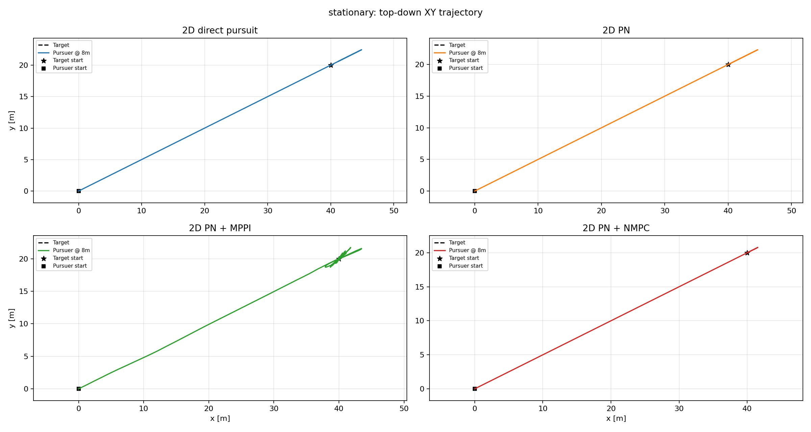

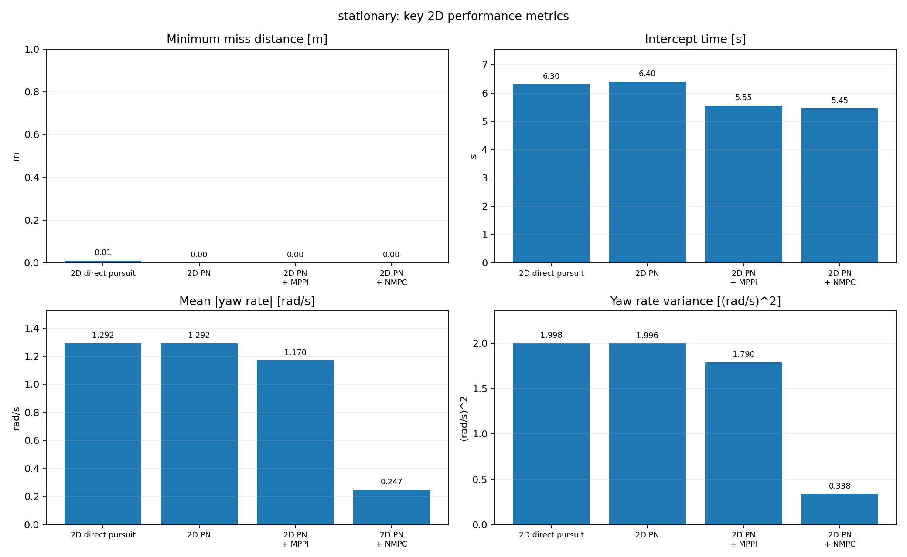

#### 匀速直线目标场景

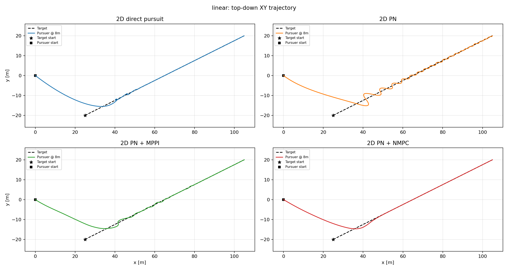

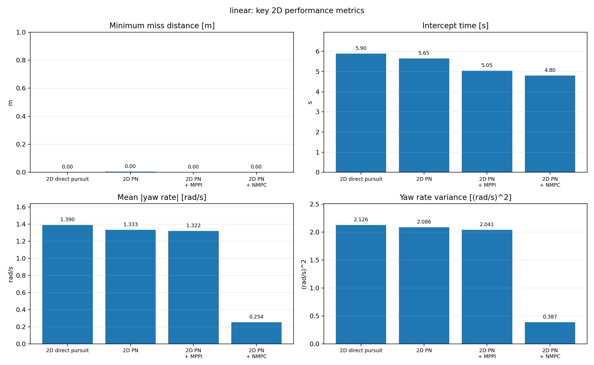

#### 圆周机动目标场景

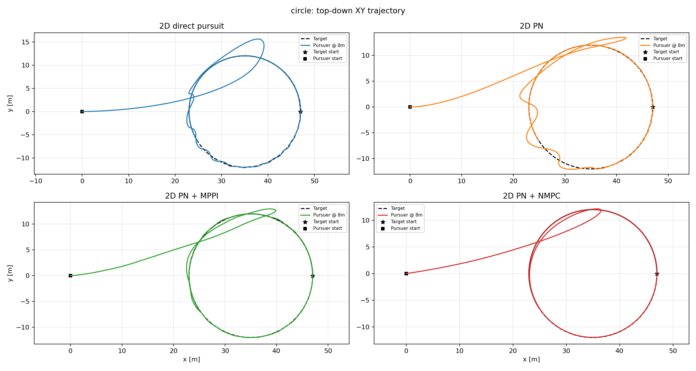

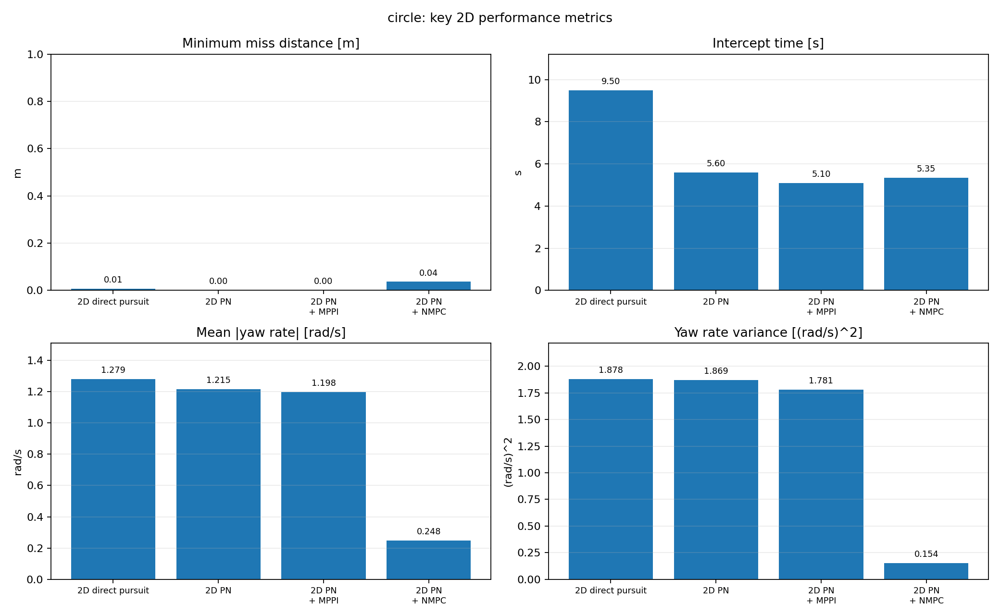

## 11. ROS2/PX4/Gazebo 闭环仿真设计

### 11.1 双机 Offboard 结构

系统包含一架追踪机和一架目标机。目标机按二维合成目标轨迹飞行；追踪机在启动阶段接收 position/velocity hold setpoint，在追踪阶段接收 velocity/acceleration setpoint。两机均由 PX4 SITL 管理底层飞控闭环，ROS2 节点负责：

1. 订阅两机 odometry；
2. 将 PX4 NED 状态转换为 ENU；
3. 启动阶段发布目标机起点 setpoint 和追踪机起飞/保持 setpoint；
4. 检查两机位置与速度是否满足就位阈值；
5. 追踪阶段调用 `compute_guidance()` 计算二维导引加速度；
6. 将限幅后的水平加速度作为 acceleration 前馈发布，并由当前速度积分得到 velocity setpoint；
7. 发布目标机参考轨迹 setpoint、追踪机 yaw setpoint 和必要的 PX4 模式命令；
8. 记录 Gazebo 样本 CSV。

### 11.2 ROS2 话题与 PX4 消息

**订阅**：

- `/<pursuer>/fmu/out/vehicle_odometry`
- `/<target>/fmu/out/vehicle_odometry`

**发布**：

- `/<pursuer>/fmu/in/offboard_control_mode`
- `/<pursuer>/fmu/in/trajectory_setpoint`
- `/<pursuer>/fmu/in/vehicle_command`
- `/<target>/fmu/in/offboard_control_mode`
- `/<target>/fmu/in/trajectory_setpoint`
- `/<target>/fmu/in/vehicle_command`

### 11.3 启动与控制流程

编译并加载 ROS2 包：

```bash
cd 7_2Dsimulation
colcon build --packages-select gazebosimulation2d
source install/setup.bash
```

启动默认 2D 导引节点：

```bash
ros2 launch gazebosimulation2d guidance.launch.py
```

指定算法和场景：

```bash
ros2 launch gazebosimulation2d guidance.launch.py algorithm:=pn_mppi scenario:=circle
```

节点控制流程为：

1. 等待追踪机和目标机均发布有效 `VehicleOdometry`；
2. 计算场景 `t=0` 的目标起点参考，并让目标机发布 position + velocity setpoint；
3. 锁定追踪机准备阶段的当前 XY 位置，将 z 改为 `pursuer_fixed_altitude`，作为追踪机起飞/保持 setpoint；
4. 两机持续发布 setpoint，并在 `offboard_warmup_cycles` 后按配置发送 Offboard 和 arm 命令；
5. 使用 `target_start_*_tolerance` 检查目标机是否到达场景起点，使用 `pursuer_takeoff_*_tolerance` 检查追踪机是否到达固定高度起飞点；
6. 两机同时 ready 后，节点重置追踪计时和上一步加速度记忆，开始 2D 追踪与数据记录；
7. 追踪阶段目标机持续发布目标轨迹 position + velocity setpoint；
8. 追踪机每周期读取两机 odometry，调用二维导引算法，发布 velocity + acceleration setpoint，其中 position 字段不启用；
9. 节点退出时保存 `gazebo_samples.csv`。

启动阶段会以 `startup_2d` 低频输出目标机/追踪机的就位误差、速度和命令状态，默认周期为 1 s。追踪阶段可通过 `debug_log:=true` 开启 `debug_2d` 周期日志：

```bash
ros2 launch gazebosimulation2d guidance.launch.py \
  algorithm:=pn_nmpc \
  scenario:=circle \
  pursuer_fixed_altitude:=8.0 \
  sim_time:=40.0 \
  debug_log:=true
```

`debug_2d` 日志包含：

- `target_odom`：目标机实际 odometry 位置、速度、加速度；
- `target_cmd`：目标机参考位置、速度、加速度和 yaw setpoint；
- `pursuer_odom`：追踪机实际 odometry 位置、速度、加速度；
- `pursuer_cmd`：追踪机 velocity + acceleration 控制指令、原始导引加速度和限幅后加速度。

日志周期可通过 launch 参数调整：

```bash
ros2 launch gazebosimulation2d guidance.launch.py debug_log:=true debug_log_period_s:=0.1
```

### 11.4 Gazebo 数据记录与后处理

Gazebo CSV 字段包括：时间、两机位置速度、追踪机实际发布的加速度指令、yaw 和 XY 距离。后处理命令示例：

```bash
uv run plot_gazebo_csv.py \
  outputs/gazebo2d/circle \
  --output-dir outputs/circle
```

`plot_gazebo_csv.py` 复用离线仿真的指标计算和绘图函数，因此 Gazebo 结果可以和离线结果使用同一套评价指标进行比较。

## 12. Gazebo/PX4 25s 闭环仿真结果

本节结果来自当前仓库中的 Gazebo/PX4 闭环记录：

```text
7_2Dsimulation/outputs/gazebo2d/circle/
```

数据口径如下：

- 场景：`circle` 圆周机动目标；
- 仿真时长：25 s；
- 原始记录：各算法目录下的 `gazebo_samples.csv`；
- 综合指标与对比图：`outputs/gazebo2d/circle/total/`；
- 四个算法的原始 CSV 均包含 502 条样本，时间范围为 0.0 s 到 25.0 s；
- 指标计算沿用离线仿真的 XY 水平距离、捕获半径、控制能量和 yaw rate 统计方式。

### 12.1 圆周目标场景 Gazebo 指标

| 算法 | 捕获时间/s | 最小距离/m | 控制能量 | 平均距离/m | 路径长度/m | yaw rate mean/rad/s | yaw rate variance |
| --- | ---: | ---: | ---: | ---: | ---: | ---: | ---: |
| 2D direct pursuit | 10.90 | 0.0370 | 648.97 | 8.89 | 113.42 | 1.415 | 1.896 |
| 2D PN | 6.15 | **0.0074** | 603.17 | 8.95 | 112.34 | 1.362 | 3.138 |
| **2D PN + MPPI** | **5.90** | 0.0197 | 250.27 | 7.83 | 101.60 | 0.822 | 1.312 |
| 2D PN + NMPC | 6.00 | 0.0781 | **174.84** | **7.82** | **96.54** | **0.340** | **0.399** |

在 25 s Gazebo 圆周目标闭环仿真中，四种算法均完成 XY 捕获。主要现象为：

- **2D direct pursuit** 捕获时间最长，控制能量和 yaw rate mean 也较高，体现出追赶式轨迹在机动目标下效率较低；
- **2D PN** 最小距离最低，说明其比例导引几何在闭环 PX4 环境中仍能形成有效拦截，但控制能量和 yaw rate 方差较高；
- **2D PN + MPPI** 捕获时间最短，同时相对 basic/PN 明显降低控制能量和 yaw 转向强度；
- **2D PN + NMPC** 捕获时间略慢于 MPPI，但控制能量、平均距离、路径长度、yaw rate mean 和 yaw rate 方差均为当前 Gazebo 输出中最优，表现出更偏向低能耗和平滑跟踪的取舍。

这些 Gazebo 结果与离线圆周场景的总体趋势一致：MPPI 更激进、捕获更快；NMPC 更平滑、更省控制，但在最小距离或首次捕获时间上不一定最优。需要注意，Gazebo 结果同时受到 PX4 底层控制、机体模型、setpoint 跟踪误差和 25 s 统计窗口影响，因此不应与 40 s 离线质点仿真的绝对数值直接等同。

### 12.2 Gazebo 综合对比插图

以下插图来自：

```text
outputs/gazebo2d/circle/total/
```

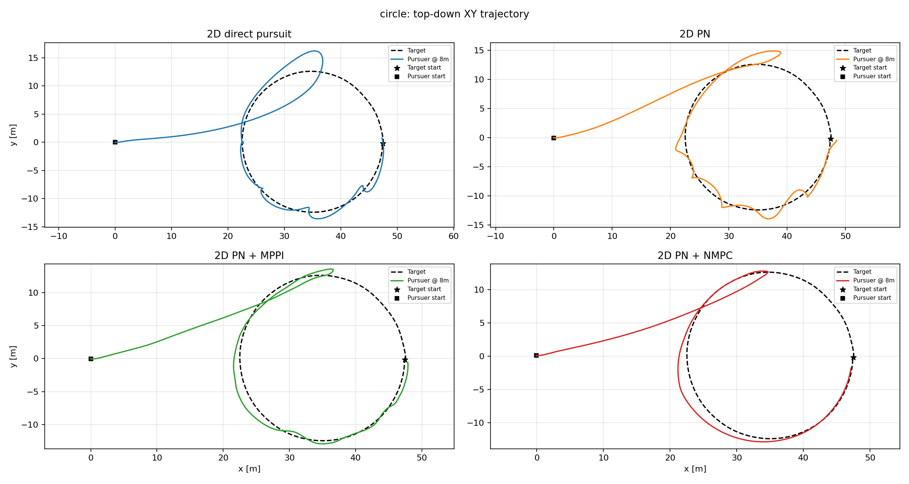

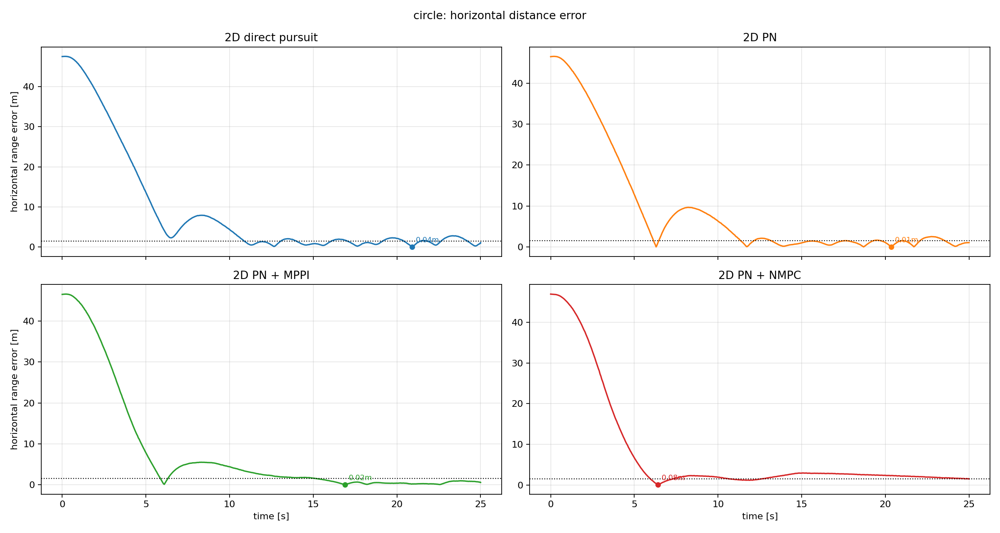

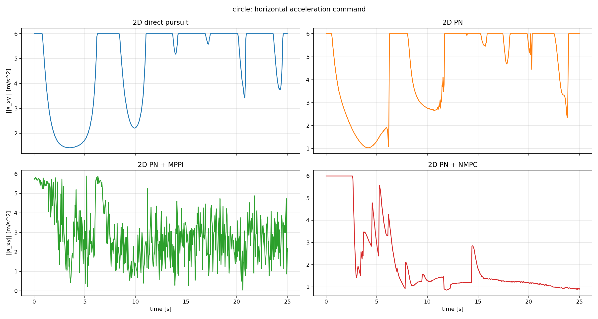

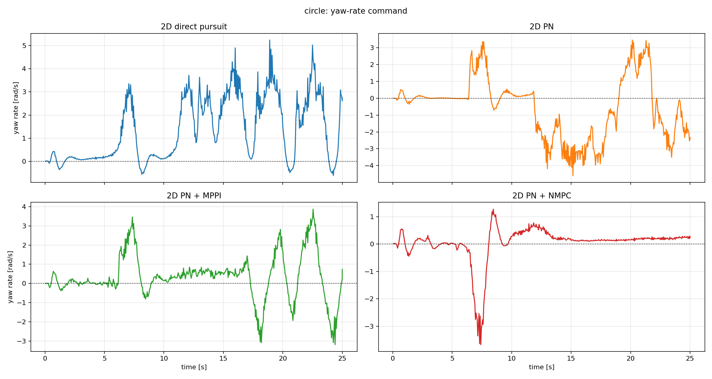

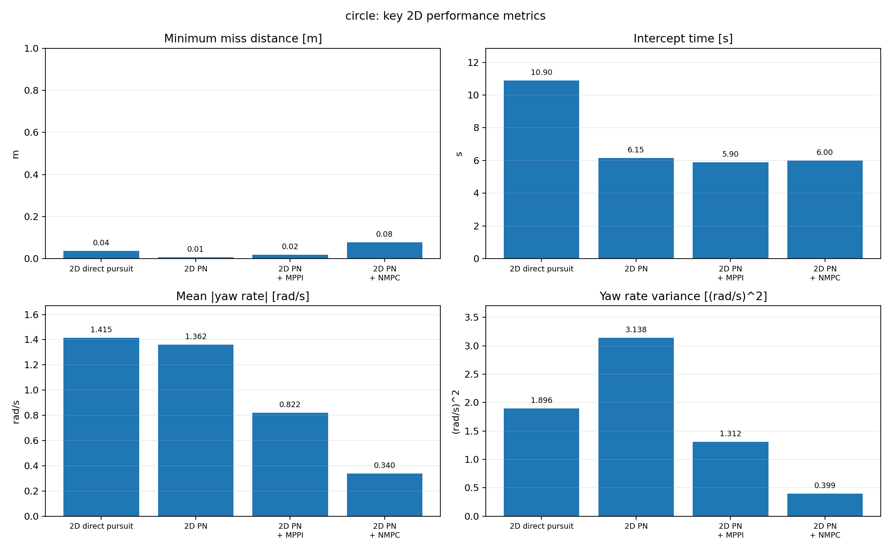

## 13. 仿真假设与局限性

- 当前模型是二维定高俯瞰追踪，不能反映完整三维机动、爬升下降或姿态动力学。
- 追踪机和目标虽然保存 `[x, y, z]` 状态，但导引与指标只使用 XY 分量。
- 当前版本不建模深度相机、有限视场、遮挡、检测延迟、误检漏检和目标丢失预测。
- yaw 只表示水平机头朝向，不包含完整 roll/pitch/yaw 姿态动力学。
- 离线仿真采用质点模型，Gazebo 结果会受到 PX4 底层控制器、机体模型、setpoint 跟踪误差和通信频率影响。
- 当前 Gazebo 追踪阶段不再通过 position setpoint 强制拉住追踪机高度，而是发布 z 速度和 z 加速度为 0 的 velocity + acceleration setpoint；实际高度保持效果取决于 PX4 底层控制器与机体响应。
- MPPI 与 NMPC 的结果依赖预测窗口、权重、候选集合、采样数、噪声尺度和温度参数。

## 14. 章节推荐结构

如果将本部分写入论文或报告，可采用以下章节结构：

```text
X 二维定高追踪仿真与结果分析
X.1 仿真平台与总体框架
X.2 二维定高运动模型与目标场景
X.3 对比算法与预测控制框架
  X.3.1 基础追踪算法
  X.3.2 二维比例导引算法
  X.3.3 PN + MPPI 采样预测控制
  X.3.4 PN + NMPC 候选式预测控制
X.4 评价指标与实验设置
X.5 离线数值仿真结果与分析
  X.5.1 静止目标场景
  X.5.2 匀速直线目标场景
  X.5.3 圆周机动目标场景
  X.5.4 综合分析
X.6 PX4/Gazebo 二维闭环仿真设计
X.7 Gazebo/PX4 闭环仿真结果
X.8 仿真结论与局限性
```
