# 二维定高目标追踪仿真系统与算法框架说明

## 1. 仿真目的与验证思路

`7_2Dsimulation` 是面向无人机目标追踪问题的 **二维定高俯瞰仿真**。与 `6_Simulation` 中的三维有限视场仿真不同，本部分的导引和指标简化到 XY 平面，不建立完整的深度相机与 FOV 可见性模型；EMPC（`pn_nmpc`）在代价中加入了固定下视相机的软性画面保持惩罚（见 7.4.1 节），用于在目标接近画幅边缘时主动回中。追踪机下视单目相机的视觉量测链路（YOLO 检测 → α-β 估计 → coast/lost 兜底）已接入，见 11.5 节。

仿真目标包括：

- 在静止、匀速直线和圆周机动目标下比较基础追踪、PN、PN + MPPI、PN + EMPC、单环位置 PID 与 PID + EMPC；
- 验证二维 PN 是否能提供有效的名义拦截趋势；
- 验证 MPPI/EMPC 是否能在短预测窗口内降低控制能量、改善 yaw 转向平滑性，并保持较好的捕获能力；
- 将纯 Python 离线仿真与 ROS2/PX4/Gazebo Offboard 接入保持同一套二维导引逻辑。

性能指标包括：捕获时间、最小水平距离、平均水平距离、路径长度、控制能量、平均 yaw 角速度和 yaw 角速度方差。

## 2. 仿真系统总体结构

仿真代码组织在 `7_2Dsimulation/` 下，主要由纯 Python 离线仿真模块和 ROS2/PX4/Gazebo 接入模块组成。

### 2.1 离线 Python 二维仿真模块

路径：`src/pythonsimulation2d/`

| 文件 | 功能 |
| --- | --- |
| `config.py` | 定义合法场景、算法名称、统一仿真参数、追踪机/目标/导引配置 |
| `state.py` | 定义追踪机、目标和仿真结果数据结构 |
| `target.py` | 生成静止、匀速直线和圆周三类二维目标轨迹 |
| `dynamics.py` | 实现追踪机二维定高运动模型和 yaw 朝向更新 |
| `guidance.py` | 实现 2D direct pursuit、2D PN、2D PID、2D PN + MPPI、2D PN + EMPC、2D PID + EMPC |
| `simulation.py` | 统一仿真循环，保证各算法在相同条件下运行 |
| `metrics.py` | 计算捕获、距离、能量、路径长度和 yaw 平滑性指标 |
| `plotting.py` | 生成轨迹、距离、加速度、yaw rate 和指标图 |
| `publication_plots.py` | 论文版式轨迹网格图：等比例面板、多算法共用坐标范围（Gazebo 后处理使用） |
| `math_utils.py` | 提供 XY 平面归一化、限幅、定高和角度更新工具函数 |
| `camera_geometry.py` | 下视相机投影/反投影、像素雅可比与前向协方差传播（无 ROS 依赖） |
| `target_filter.py` | 视觉量测 α-β 估计器与 coast/lost 状态机（无 ROS 依赖） |

### 2.2 ROS2/PX4/Gazebo 二维闭环接入模块

路径：`src/gazebosimulation2d/`。该包通过 `px4_msgs` 使用 PX4 ROS2 消息类型；`src/px4_msgs` 被 `.gitignore` 忽略、不在版本库中，因此首次构建必须先用 `--packages-up-to` 把 `px4_msgs` 一并编译出来。

- `gazebosimulation2d` 是 ROS2 Python 包，用于将二维导引算法接入 PX4/Gazebo 双机 Offboard 仿真。
- `guidance_node.py` 控制两架 PX4 实例：`/px4_1` 为追踪机，`/px4_2` 为目标机。
- 目标机按 `pythonsimulation2d.target.target_state()` 生成的二维参考轨迹飞行，高度由 `target_base_altitude` 固定。
- 启动阶段目标机先飞到场景起点，追踪机锁定准备阶段当前 XY 并起飞到 `pursuer_fixed_altitude`（`target_source=vision` 时改为飞至场景起点上方，保证初始捕获）；两机都满足位置和速度阈值后，才开始追踪和数据记录。
- 追踪阶段追踪机读取两机 `VehicleOdometry`，在 ENU 坐标下调用二维导引算法；导引输出的水平加速度经限幅后作为 PX4 acceleration 前馈，同时由当前速度积分得到 velocity setpoint。
- 追踪阶段追踪机 `TrajectorySetpoint.position` 不启用，`OffboardControlMode` 使用 `velocity=True, acceleration=True`；z 速度和 z 加速度指令为 0。
- 节点发布 `OffboardControlMode`、`TrajectorySetpoint` 和 `VehicleCommand`。
- `src/gazebosimulation2d/config/default.yaml` 与 `src/gazebosimulation2d/launch/guidance.launch.py` 暴露了启动就位阈值、调试日志周期和记录目录等参数。
- Gazebo 记录结果保存为 `outputs/gazebo2d/<scenario>/<algorithm>/gazebo_samples.csv`，可由 `plot_gazebo_csv.py` 后处理。

视觉量测链路（`enable_camera:=true` 时按 `vision_source` 创建，详见 11.5 节与 [视觉设计参考](vision_design.md)）：

| 文件 | 功能 |
| --- | --- |
| `vision_detector.py` | 订阅图像、按 `process_hz` 节流，把帧交给 conda 常驻 YOLO worker，发布 `/camera/detections` |
| `scripts/yolo_worker.py` | 常驻推理子进程（stdio 协议），加载 `.engine`/`.pt`，超时/崩溃按上限重启 |
| `vision_adapter.py` | 消费检测结果，按图像 stamp 在位姿缓存中插值相机位姿，反投影并发布 `/vision/target_pose` |
| `camera_recorder.py` | 旁路记录相机画面（JPEG），用于区分"模型漏检"与"目标不在视野" |
| `image_utils.py`、`sim_clock.py`、`recording_paths.py` | 图像编码转换、`/clock` 防呆与统一输出路径解析 |

`worlds/default.sdf` 是仓库内置的无阴影世界（相对 PX4 v1.16 的 `default.sdf` 只关闭阴影投射）。下视相机 8 m 高度、目标平面 1 m 时太阳仰角约 51°，两机影子会偏移约 5.7 m 落进画面，YOLO 容易把影子误检成目标，因此视觉闭环必须使用该世界。

## 3. 坐标系与状态变量定义

### 3.1 二维定高仿真坐标系

算法内部使用 ENU 坐标表达状态，但导引、距离和指标均按 XY 水平面计算：

| 轴向 | 含义 |
| --- | --- |
| x | East（东） |
| y | North（北） |
| z | Up（天），在本部分中作为固定高度保存 |

追踪机状态包括位置 `p_p`、速度 `v_p`、加速度 `a_p` 和 yaw。目标状态包括位置 `p_t`、速度 `v_t` 和加速度 `a_t`。

本部分仍使用三维数组保存状态 `[x, y, z]`，但控制律只作用在 XY 分量：

- 追踪机高度固定为 `pursuer.fixed_altitude = 8.0 m`；
- 目标高度固定为 `target.fixed_altitude = 1.0 m`；
- 捕获判定和距离指标使用 XY 水平距离，不包含固定高度差。

### 3.2 Gazebo/PX4 坐标转换

PX4 使用 NED 坐标系，二维导引算法内部保持 ENU 坐标系，仅在 ROS2/PX4 接口边界执行坐标转换：

- 启动阶段 ENU 位置/速度转换为 NED position/velocity setpoint；
- 追踪阶段 ENU 速度/加速度转换为 NED velocity/acceleration setpoint，追踪机 position 字段保持未启用；
- PX4 odometry 从 NED 转换回 ENU 后进入导引计算；
- yaw setpoint 根据追踪机当前位置和目标参考位置计算后转换到 NED 表达。

这种设计使离线仿真和 Gazebo 接入复用同一套 `pythonsimulation2d` 导引代码，降低两套实现不一致的风险。

## 4. 追踪机运动模型与物理约束

### 4.1 二维定高质点模型

导引算法输出水平加速度指令 `a_cmd`，经 XY 平面限幅后离散积分更新速度和位置：

```text
a_k = sat_xy(a_cmd, a_max)
v_{k+1} = sat_xy(v_k + a_k * dt, v_max)
p_{k+1,xy} = p_{k,xy} + v_{k+1,xy} * dt
p_{k+1,z} = fixed_altitude
```

其中：

- `||v_xy|| <= v_max`；
- `||a_xy|| <= a_max`；
- z 方向速度和加速度始终为 0；
- 追踪机位置在每个积分步被锁定到固定高度。

### 4.2 yaw 朝向模型

yaw 用于描述二维俯瞰平面内的机头朝向。每个仿真步中，追踪机 yaw 以最大角速度 `yaw_rate_max` 逐渐转向 `look_at_position` 的水平投影。

当前四类算法都将目标当前位置作为 `look_at_position`。因此，yaw 平滑性主要反映追踪轨迹和目标相对方向变化是否剧烈，而不是 FOV 保持能力。

### 4.3 默认仿真参数

| 参数 | 数值 | 含义 |
| --- | ---: | --- |
| `dt` | 0.05 s | 主仿真步长 |
| `sim_time` | 40 s | 单次仿真时长 |
| `capture_radius` | 1.5 m | XY 捕获判定半径 |
| `pursuer.fixed_altitude` | 8.0 m | 追踪机固定高度 |
| `target.fixed_altitude` | 1.0 m | 目标固定高度 |
| `v_max` | 12 m/s | 追踪机最大水平速度 |
| `a_max` | 6 m/s^2 | 追踪机最大水平加速度 |
| `yaw_rate_max` | 90 deg/s | 最大 yaw 角速度 |

### 4.4 Gazebo 接入默认参数

以下参数由 `src/gazebosimulation2d/config/default.yaml` 和 `src/gazebosimulation2d/launch/guidance.launch.py` 提供，主要影响 PX4/Gazebo 闭环启动与调试：

| 参数 | 默认值 | 含义 |
| --- | ---: | --- |
| `control_rate_hz` | 20.0 Hz | ROS2 导引节点控制周期 |
| `offboard_warmup_cycles` | 20 | 发送 setpoint 后再切 Offboard/解锁的预热周期数 |
| `target_start_position_tolerance` | 0.75 m | 目标机到场景起点的位置就位阈值 |
| `target_start_velocity_tolerance` | 0.75 m/s | 目标机启动阶段速度就位阈值 |
| `pursuer_takeoff_position_tolerance` | 0.75 m | 追踪机起飞/保持点的位置就位阈值 |
| `pursuer_takeoff_velocity_tolerance` | 0.75 m/s | 追踪机起飞/保持点的速度就位阈值 |
| `debug_log` | false | 是否开启追踪阶段 `debug_2d` 周期日志 |
| `debug_log_period_s` | 0.2 s | `debug_2d` 日志周期 |
| `startup_log_period_s` | 1.0 s | 启动阶段 `startup_2d` 日志周期 |

视觉闭环相关参数（`target_source:=vision` 时生效）由同一组 YAML 与 launch 提供，完整表见 [模块 README](../README.md#导引节点视觉参数target_sourcevision)：

| 参数 | 默认值 | 含义 |
| --- | ---: | --- |
| `target_source` | odometry | 导引输入来源：`odometry`（读目标机 odometry）或 `vision`（读 `/vision/target_pose`） |
| `vision_alpha` / `vision_beta` | 0.85 / 0.25 | α-β 估计器系数（需满足 `0 < beta < 4 - 2*alpha`） |
| `vision_accel_tau_s` | 0.5 s | 目标加速度前馈的一阶低通时间常数 |
| `vision_max_age_s` | 0.5 s | 量测到控制周期的时延上限，超限按过期丢弃 |
| `vision_coast_s` / `vision_loss_s` | 0.3 / 1.0 s | `tracking → coast → lost` 的状态机阈值 |

## 5. 目标运动场景设计

### 5.1 静止目标场景

- 目标固定在 `[40, 20, 1] m`。
- 验证算法最基本的二维收敛和捕获能力。
- 适合比较控制能量和 yaw 平滑性差异。

### 5.2 匀速直线目标场景

- 初始位置 `[25, -20, 1] m`，速度 `[2, 1, 0] m/s`。
- 验证算法处理目标速度和闭合速度的能力。
- 适合比较 direct pursuit、PN 与预测控制在捕获时间和控制经济性上的差异。

### 5.3 圆周机动目标场景

- 圆心 `[35, 0, 1] m`，半径 12 m，角速度 0.25 rad/s。
- 目标持续改变 LOS 方向，是二维追踪中更具挑战性的测试场景。
- 适合观察 PN、MPPI 和 EMPC 对目标机动的响应能力。

### 5.4 桌下遮挡场景

`table_occlusion` 的目标参考以 0.5 m/s 沿 +X 从 `(0,0,1)` 飞到 `(12,0,1)`，在 `(6,0,1)` 悬停 3 秒；Gazebo 加入 2 × 2 m 桌面和实际停稳计时，用于观察视觉丢失后重新找回目标。纯 Python 同名场景只包含理想运动参考。启动与指标口径见 11.4 节。

## 6. 对比算法与框架原理

| 算法名称 | 角色 | 主要功能 |
| --- | --- | --- |
| `basic` / 2D direct pursuit | 基线算法 | 水平速度方向始终指向目标当前位置 |
| `pn` / 2D PN | 比例导引基线 | 使用二维 LOS 角速度生成横向修正，并加入沿 LOS 接近项 |
| `pn_mppi` / 2D PN + MPPI | 采样预测控制对比 | 围绕 PN 名义控制采样多条控制序列并按代价加权 |
| `pn_nmpc`（历史代码标识）/ 2D PN + EMPC | 本部分重点算法 | 围绕 PN 趋势枚举候选控制，并用短时预测代价选择当前加速度 |
| `pid` / 2D PID tracking | 经典反馈对照 | 对 XY 位置误差做 PID（D 项取相对速度误差），直接输出加速度，带积分抗饱和 |
| `pid_nmpc` / 2D PID + EMPC | PID + 预测混合 | PID 给出名义参考加速度，EMPC 围绕参考枚举候选并输出实际加速度 |

命名说明：本文将该候选枚举式控制器统一称为 **EMPC（Enumerative Model Predictive Control，枚举式模型预测控制）**。当前源代码、命令行参数、输出目录、已有 CSV 和已生成图片图例中仍保留 `pn_nmpc`、`nmpc_acceleration()`、`nmpc_w_*` 以及标签 `2D PN + NMPC` 等历史标识，以避免破坏现有接口和结果文件；这些标识在本文中均指 EMPC，不表示该实现是连续非线性规划意义上的 NMPC。`pid_nmpc` 是同一 EMPC 换用 PID 名义参考后的新增标识。本文的 EMPC 也不是以经济目标为核心的 Economic MPC。

### 6.1 2D direct pursuit

基础追踪法计算追踪机到目标当前位置的 XY 单位方向，设定期望巡航速度，并通过一阶速度跟踪得到加速度指令：

```text
u = normalize_xy(p_t - p_p)
v_des = v_cruise u
a_cmd = (v_des - v_p) / tau
```

该方法简单稳定，但不显式预测目标未来运动，对机动目标容易出现追赶式轨迹。

### 6.2 2D PN：提供名义拦截趋势

二维 PN 根据相对位置、相对速度和 LOS 角速度生成横向拦截加速度。设：

```text
r = p_t - p_p
u_LOS = r_xy / ||r_xy||
v_rel = v_t - v_p
```

闭合速度和二维 LOS 角速度为：

```text
V_c = max(0, -v_rel_xy · u_LOS)
omega_LOS = (r_x v_rel_y - r_y v_rel_x) / ||r_xy||^2
```

二维横向单位向量为：

```text
lateral = [-u_LOS_y, u_LOS_x]
```

PN 横向加速度为：

```text
a_PN = N V_c omega_LOS lateral
```

为了增强主动接近能力，代码中还加入沿 LOS 方向的闭合项：

```text
a_close = k_close (v_des_along_los - v_p · u_LOS) u_LOS
a_nom = sat_xy(a_PN + a_close, a_max)
```

在组合框架中，PN 不负责处理全部控制品质问题，而是提供几何意义明确的名义拦截趋势。

### 6.3 2D PN + MPPI：采样式预测控制

MPPI 以 PN 加速度为名义控制序列，在预测窗口内采样多条带噪声的加速度序列。每条序列都通过二维定高模型前向滚动，并根据综合代价得到权重，最终将第一步控制按权重融合为当前控制量。

其主要特点是：

- 可以探索 PN 附近的多个控制方向；
- 通过采样平滑噪声生成控制序列；
- 使用固定随机种子保证对比可复现；
- 相比候选式 EMPC，MPPI 更依赖采样数量、噪声尺度和温度参数。

### 6.4 2D PN + EMPC：候选式短时预测优化

本部分中的 EMPC 是围绕 PN 名义趋势进行候选枚举的轻量预测控制器，而不是依赖 CasADi/acados 等外部求解器的连续优化器。控制流程为：

1. 计算包含 PN 横向项和沿 LOS 闭合项的名义控制 `a_nom`；
2. 围绕 `a_nom` 构造 16 个候选控制，包括缩放 PN 名义控制、直接拦截、同速接近、速度匹配、稳定跟踪、软跟踪和 LOS 垂直扰动等；
3. 对每个候选加速度，在整个预测窗口内保持该候选为常值，并使用相同二维定高动力学前向滚动；
4. 目标预测使用当前目标状态的常加速度外推，即 `p_t(t) = p_t0 + v_t0·t + 0.5·a_t0·t²`，`v_t(t) = v_t0 + a_t0·t`；目标加速度在整个预测时域内保持为调用时刻的初始值；
5. 计算距离、路径、速度误差、稳态误差、控制能量、控制平滑性、偏离 PN 趋势和画面偏移（FOV）等代价；
6. 选择综合代价最低的候选作为当前控制。

关键特征是：候选控制由导引几何和跟踪意图构造，可解释性强；预测控制只对 PN 趋势做有限修正，避免控制完全偏离拦截逻辑。

### 6.5 2D PID tracking：纯反馈对照

PID 控制律不使用 LOS 角速度、预测优化或目标加速度前馈：对目标与追踪机的 XY 位置误差做比例-积分-微分，直接输出水平加速度。视觉模式的输入仍经过公共 α-β 估计器滤波与外推。

```text
e = p_t - p_p
e_v = v_t - v_p
I = clamp_norm(∫e dt, I_max)
a_cmd = sat_xy(kp e + ki I + kd e_v, a_max)
```

其中 D 项取相对速度误差 `e_v`，等价于对位置误差求导，起阻尼作用；积分项按向量范数 `I_max` 限幅抗饱和；输出受与其它算法相同的 `a_max` 约束。默认参数在三种离线场景上网格整定：

| 参数 | 数值 | 含义 |
| --- | ---: | --- |
| `pid_kp` | 2.5 | 位置比例增益；闭环近似二阶系统 `ω_n = sqrt(kp) ≈ 1.58 rad/s` |
| `pid_kd` | 2.6 | 速度阻尼增益；阻尼比 `ζ = kd / (2 sqrt(kp)) ≈ 0.82`，略欠阻尼 |
| `pid_ki` | 0.1 | 积分增益，慢速消除稳态偏置 |
| `pid_integral_limit` | 3.0 m·s | 积分向量范数上限 |

整定方法：固定积分限幅，对 `kp ∈ {1.5, 2.0, 2.5, 3.0, 4.0}`、`kd ∈ {1.8, 2.2, 2.6, 3.0, 3.6}`、`ki ∈ {0, 0.05, 0.1, 0.2}` 做网格搜索，排序指标为三种场景的「捕获时间之和 + 2 × 平均距离之和 + 0.002 × 控制能量之和」。最终取值与网格最优区（`kp = 3～4`）的捕获表现接近，但控制能量更低，且二阶闭环参数容易解释。

ROS2/PX4/Gazebo 接入使用 `algorithm:=pid`，与离线仿真共用 `compute_guidance()`，四个 PID 参数均可通过 launch 覆盖，默认值保持上表。odometry 模式使用目标机状态；YOLO 视觉模式使用反投影量测经 α-β 滤波、外推后的目标位置和速度，输出仍走水平速度 + 加速度 setpoint 链路，不直接对像素误差做 PID。

视觉短时漏检时继续按预测目标状态积分；超过丢失阈值进入 hold 时清零积分并发布零速、零加速度，悬停期间不累积；重新收到有效量测后恢复跟踪并从零重新积分，不回退目标 odometry。追踪阶段开始时同样清零积分。

需要注意：本次接入验收为单元测试与 ROS 包构建，未运行实际 Gazebo/YOLO 闭环飞行，也未重新整定参数。第 10 节仍是纯 Python 离线对比：模型无噪声、全状态（位置/速度）精确可得、执行器无滞后，PID 的反馈优势会被高估，离线排名不能直接外推到真实闭环。

### 6.6 2D PID + EMPC：PID 名义参考的候选式预测控制

`pid_nmpc` 把 6.5 的单环 PID 作为 EMPC 的名义参考：每个控制周期先计算

```text
a_ref = sat_xy(kp e + ki I + kd e_v, a_max)
```

积分项每个控制周期只累积一次；随后把 `a_ref` 传给 6.4 的候选枚举与代价选择，输出实际加速度指令。与 `pn_nmpc` 的唯一区别是名义趋势从 2D PN 换成 PID：候选集合仍包含参考本身、参考的缩放/混合、直接拦截、同速接近、稳定/软跟踪与 LOS 垂直扰动，代价函数中 `nmpc_w_pn`（历史字段名）一项此时表示“偏离 PID 参考”的惩罚。

两个极限行为便于理解权重含义：`nmpc_w_pn` 很大时任何偏离参考的候选代价都被放大，输出退化为纯 PID；权重变小时 EMPC 才能用预测距离、控制平滑和画面保持（FOV）惩罚修正 PID 参考。PID 参数与 `pid` 共用，视觉链路的 coast 积分、hold 清零语义也保持一致。

## 7. 预测控制代价函数设计

### 7.1 公共预测窗口参数

| 参数 | 数值 | 含义 |
| --- | ---: | --- |
| `horizon_steps` | 8 | 预测步数 |
| `mpc_dt` | 0.1 s | 预测步长 |
| 预测时域 | 0.8 s | `horizon_steps * mpc_dt` |

预测窗口取 0.8 s 而不是更长的 2 s，是为了适配真实 PX4 闭环的执行器滞后：窗口越长，EMPC 内部模型越会高估自身的加速度响应、预判激进候选"会飞过目标"，从而持续选择偏保守的小修正。视觉闭环实测中 2 s 窗口会让追踪机停在目标外侧的大半径轨道上（水平误差峰值 6.1～6.9 m），缩短到与执行器动态同量级后闭环最大误差回到 3 m 量级（2026-10-04 四算法复测为 3.17 m）；离线质点仿真的捕获时间也随之缩短（见 10.1～10.3）。

### 7.2 主要权重

| 权重 | 数值 | 含义 |
| --- | ---: | --- |
| `nmpc_w_dist`（历史字段名） | 12.0 | 终端距离及 EMPC 附加终端/稳态项的基础权重 |
| `nmpc_w_path`（历史字段名） | 0.5 | 预测路径距离及 EMPC 速度匹配项的基础权重 |
| `nmpc_w_control`（历史字段名） | 0.015 | 控制能量权重 |
| `nmpc_w_smooth`（历史字段名） | 0.08 | 控制平滑权重 |
| `nmpc_w_pn`（历史字段名） | 1.0 | 偏离名义趋势权重：`pn_nmpc` 为 PN 趋势，`pid_nmpc` 为 PID 参考 |
| `nmpc_w_fov` | 120.0 | 画面偏移（FOV）惩罚权重，只作用于 EMPC，见 7.4.1 |

`nmpc_w_path` 和 `nmpc_w_pn` 提高后，EMPC 更倾向在整个窗口内持续接近目标、并在内部模型不可靠时跟随已被验证的名义趋势（候选集合里保留参考本身；`pn_nmpc` 为 2D PN、`pid_nmpc` 为 PID 参考），代价是控制更激进、yaw rate mean 不再是最低项。

`pn_k_close`、`pn_v_des_along_los` 与 `nmpc_w_pn` 也可通过 launch 覆盖（默认值与 `pythonsimulation2d/config.py` 一致）。其中 `pn_k_close` 默认值从 1.0 调整为 0.25：该增益让近距 $a_{\text{close}}$ 恒为推力、$a=0$ 不再是平衡点，视觉闭环会在目标附近形成 6 m/s² 满推力绕飞极限环（桌下遮挡场景实测）；降低后由 EMPC 的阻尼候选接管，绕飞消失，circle 闭环精度基本不变（0.72 vs 0.76 m）且控制能量降至约 1/7。第 10 节的离线对比表生成于旧默认值（1.0），重跑后 `pn_nmpc` 的能量与平均距离会进一步下降。

EMPC 画面保持惩罚的相机参数采用追踪机下视相机的标称值：图像 1280×960、`fx = fy = 539.936 px`、安装高度偏移 0.10 m、目标控制平面 1.0 m；软边界 `fov_soft_margin = 0.5`，封顶 `fov_violation_cap = 3.0`（归一化偏移，1.0 为画面边缘）。这些参数与视觉链路（`vision_adapter` 的内参/外参）一致，更换相机或安装后需同步修改 `pythonsimulation2d/config.py` 中的 `fov_*` 默认值。

### 7.3 代价函数的通用形式

本仿真中 EMPC 和 MPPI 的代价函数均采用终端代价与预测窗口累计代价相加的结构：

$$
J = \Phi(x_H) + \sum_{k=1}^{H} L_k(x_k, u_k, \tilde u_{k-1})
$$

其中 $x_k = [p_k, v_k]$ 为追踪机第 $k$ 步状态，$u_k=a_k$ 为水平加速度，$\tilde u_0$ 为上一仿真周期实际采用的加速度，此后 $\tilde u_{k-1}=u_{k-1}$。代码中的路径累计包含第 $H$ 步，同时还会额外计算终端项，因此终端状态同时出现在路径累计和终端代价中。

#### 7.3.1 各项代价的通用归类

| 类型 | 符号 | 数学形式 | 范数类型 |
|------|------|---------|---------|
| 终端位置误差 | $\Phi_{\text{dist}}$ | $w_1 \cdot \|\Delta p_H\|_2$ | 未平方欧氏范数 |
| 终端速度误差 | $\Phi_{\text{vel}}$ | $\alpha w_1 \cdot \|\Delta v_H\|_2$ | 未平方欧氏范数 |
| 路径跟踪 | $L_{\text{path}}$ | $w_2 \cdot \|\Delta p_k\|_2$ | 未平方欧氏范数 |
| 速度匹配 | $L_{\text{vel}}$ | $\beta w_2 \cdot \|\Delta v_k\|_2^2 \Delta t$ | 平方欧氏范数 |
| 控制能量 | $L_{\text{ctrl}}$ | $w_3 \cdot \|u_k\|_2^2 \Delta t$ | 平方欧氏范数 |
| 控制平滑 | $L_{\text{smooth}}$ | $w_4 \cdot \|u_k-\tilde u_{k-1}\|_2^2$ | 平方欧氏范数 |
| PN 趋势偏离 | $L_{\text{ref}}$ | $w_5 \cdot \|u_k-u_{\text{nom}}\|_2^2$ | 平方欧氏范数 |
| 后半窗口稳态 | $L_{\text{steady}}$ | $\gamma w_1 \cdot s(k) \cdot \left(\|\Delta p_k\|_2^2+\lambda\|\Delta v_k\|_2^2\right)$ | 平方欧氏范数 |
| 画面偏移（FOV） | $L_{\text{fov}}$ | $w_6 \cdot \left(\dfrac{\min(\max(m_k-m_{\text{soft}},\,0),\,m_{\text{cap}}-m_{\text{soft}})}{1-m_{\text{soft}}}\right)^2$ | 归一化最大范数 |

其中 $\alpha=0.45$、$\beta=0.35$、$\gamma=0.18$、$\lambda=0.35$ 为代码中的固定系数，$s(k)$ 在 $k>H/2$ 时为 1，否则为 0。$L_{\text{fov}}$ 中的 $m_k=\max(|u_k|,|v_k|)$ 是预测目标在图像中的归一化偏移（±1 为画面边缘，$u$ 对应画幅宽轴、$v$ 对应高轴），$w_6$ 即 `nmpc_w_fov`，$m_{\text{soft}}$、$m_{\text{cap}}$ 为软边界与封顶值；偏移在软边界内或超过封顶后该步代价都取 0 或常数，不产生回中梯度。所有范数均由 `norm_xy()`/`np.linalg.norm(...[:2])` 计算，只使用 XY 分量；$L_{\text{fov}}$ 使用图像平面的归一化偏移而不是 XY 距离，因此会区分画幅长短轴与 yaw 朝向。

#### 7.3.2 统一展开形式

将各项代入，得到完整的单行代价：

$$
\begin{aligned}
J = &\sum_{k=1}^{H} \Big[ w_{\text{path}} \|\Delta p_k\|_2 + \beta w_{\text{path}} \|\Delta v_k\|_2^2 \Delta t + w_{\text{ctrl}} \|u_k\|_2^2 \Delta t \\
     &+ w_{\text{smooth}} \|u_k-\tilde u_{k-1}\|_2^2 + w_{\text{pn}} \|u_k-u_{\text{nom}}\|_2^2 \\
     &+ \gamma w_{\text{dist}} s(k) \left(\|\Delta p_k\|_2^2+\lambda\|\Delta v_k\|_2^2\right) \\
     &+ w_{\text{fov}} \left(\frac{\operatorname{clip}(m_k,\,m_{\text{soft}},\,m_{\text{cap}})-m_{\text{soft}}}{1-m_{\text{soft}}}\right)^2 \Big] \\
     &+ w_{\text{dist}} \|\Delta p_H\|_2 + \alpha w_{\text{dist}} \|\Delta v_H\|_2
\end{aligned}
$$

这里的“未平方欧氏范数”和“平方欧氏范数”不能分别写成 $L_1$ 与 $L_2$ 范数：两者底层都是 $L_2$（欧氏）范数，区别仅在于是否再平方。

### 7.4 EMPC 代价结构

EMPC 使用上述完整代价。对第 $i$ 个候选，代码令整个预测窗口内 $u_{i,k}=u_i$，而不是优化一条随步数变化的控制序列。因此除第一步相对上一仿真周期加速度的变化外，该候选内部后续各步的平滑增量均为 0。终端速度误差、速度匹配代价和后半窗口稳态代价的作用为：
- 终端速度误差降低接近目标时的速度不匹配；
- 速度匹配代价在整条预测轨迹上鼓励追踪机与目标保持相近速度；
- 末端稳态代价在后半预测窗口加强位置和速度的二次惩罚，抑制掠过目标后的振荡。

EMPC 使用候选式寻优：对一组由导引几何构造的候选加速度逐个计算上述代价，选择代价最低的候选作为当前控制量。

#### 7.4.1 EMPC 画面保持（FOV）惩罚

追踪相机固定下视，目标相对机体的水平偏移越大，成像越靠近画幅边缘；目标压边或出画后视觉量测中断，只能由估计器 coast/hold 兜底。原代价函数只有距离项，无法区分"距离稍大但画面居中"和"距离接近但偏在画面边缘"，因此 EMPC 在预测代价中增加了画面偏移惩罚 `nmpc_w_fov`（MPPI 代价不含该项）：

- 对预测窗口的每一步，把候选加速度下前向滚动的追踪机状态和预测目标位置代入标称下视相机的针孔投影（与 `vision_adapter` 的内参/外参一致），得到归一化图像偏移 $[u,v]$；$m=\max(|u|,|v|)$，$\pm1$ 对应画幅边缘。
- 偏移未超过软边界 $m_{\text{soft}}=0.5$ 时惩罚为 0；超过后按 $\left((m-m_{\text{soft}})/(1-m_{\text{soft}})\right)^2$ 增长，在画面边缘归一化为 1，`nmpc_w_fov=120`；超过封顶 $m_{\text{cap}}=3.0$ 后不再增大，避免远距离接近段让 FOV 项压过拦截几何。
- 预测窗口内的 yaw 按 `look_at` 预测目标更新，矩形画幅的长短轴差异和目标相对机体的方向都会进入偏移计算；它与纯 XY 距离阈值不同，是"图像平面"上的保持约束。

7.3.1 的软边界—封顶设计使惩罚只在目标接近画幅边缘时提供额外回中梯度；远程接近段（$m$ 很大）对候选选择的相对影响被截断。Gazebo 视觉闭环的验证结果见 12.5 节。

### 7.5 MPPI 代价结构

MPPI 使用简化代价，不包含终端速度误差、速度匹配代价和末端稳态代价：

$$
J_i = \sum_{k=1}^{H} \Big[ w_{\text{path}}\|\Delta p_{i,k}\|_2 + w_{\text{ctrl}}\|u_{i,k}\|_2^2\Delta t + w_{\text{smooth}}\|u_{i,k}-\tilde u_{i,k-1}\|_2^2 + w_{\text{pn}}\|u_{i,k}-u_{\text{nom}}\|_2^2 \Big] + w_{\text{dist}}\|\Delta p_{i,H}\|_2
$$

随后进行指数加权：

$$
\text{weight}_i = \exp\!\left(-\frac{J_i - \min(J)}{\tau}\right), \qquad
a_{\text{cmd}} = \frac{\sum_i \text{weight}_i \cdot a_{i,\text{first}}}{\sum_i \text{weight}_i}
$$

### 7.6 EMPC 与 MPPI 的目标预测模型差异

| 特性 | EMPC (`_rollout_cost`) | MPPI (`_mppi_sequence_costs`) |
|------|------------------------|-------------------------------|
| 位置预测 | $p_t(t) = p_{t0} + v_{t0} \cdot t + \frac{1}{2} a_{t0} \cdot t^2$ | $p_t(t) = p_{t0} + v_{t0} \cdot t$ |
| 速度预测 | $v_t(t) = v_{t0} + a_{t0} \cdot t$ | $v_t(t) = v_{t0}$（恒速） |
| 加速度假设 | 常加速度（保持调用时刻的初始值） | 忽略目标加速度 |
| 更新方式 | 每步从初始状态解析计算（非递推） | 每步从初始状态解析计算（非递推） |

在离线仿真中，EMPC 利用 `target_state()` 给出的当前目标加速度进行常加速度外推，而 MPPI 使用恒速外推。MPPI 未加入速度匹配项是当前代价函数的设计选择，并非恒速预测模型的必然结果。

需要区分目标状态的来源，三种情况下传给 EMPC 预测器的目标加速度 `a_t0` 并不相同：

| 场景 | 传入 EMPC 的目标状态 | 预测器的实际行为 |
| --- | --- | --- |
| 离线纯 Python 仿真 | 解析轨迹状态，含解析加速度 | 常加速度外推 |
| Gazebo，`target_source=odometry`（默认） | 目标机 `VehicleOdometry`，`acceleration` 置零 | 退化为基于实测位置、速度的恒速外推 |
| Gazebo，`target_source=vision`（视觉闭环） | α-β 估计器的位置/速度，以及低通差分加速度 | 常加速度外推，加速度为在线估计值 |

也就是说：odometry 模式下解析圆周参考轨迹里的向心加速度只用于目标参考生成和调试显示（`target_cmd` 日志），并未传入追踪机的 EMPC 预测器；而视觉闭环下目标加速度来自 `vision_accel_tau_s = 0.5 s` 的一阶低通差分估计，EMPC 用的是在线估计而不是真值。

## 8. 性能评价指标

| 指标 | 含义 | 评价方向 |
| --- | --- | --- |
| `capture_time` | 第一次进入 XY 捕获半径的时间；未捕获时记为仿真时长 | 越小越好 |
| `min_distance` | 仿真过程中的最小 XY 相对距离 | 越小越好 |
| `mean_distance` | 平均 XY 相对距离 | 越小越好 |
| `path_length` | 追踪机 XY 轨迹长度 | 越短越经济 |
| `control_energy` | `sum(||a_xy||^2 * dt)` | 越小越省 |
| `yaw_rate_mean` | 平均 yaw 角速度绝对值 | 越小越平滑 |
| `yaw_rate_variance` | yaw 角速度方差 | 越小越平滑 |

注意：上表是**导引侧**指标，本部分不建立完整的深度相机与 FOV 可见性模型（EMPC 的软性画面保持惩罚见 7.4.1 节）。视觉闭环另外产出**量测侧**指标——帧级检出率、最长连续丢失、量测时延与拒绝原因分布——由 `plot_vision_csv.py` 处理 `vision_samples.csv` / `yolo_detections.csv` 得到，实测值见 [视觉验证记录](yolo_vision_closed_loop_results.md)；第 12 节给出同一批跑批的导引侧指标。

## 9. 离线 Python 仿真流程

进入目录并运行默认场景：

```bash
cd 7_2Dsimulation
uv run main.py
```

运行三种场景下的全部算法：

```bash
uv run main.py --scenario all
```

指定场景、仿真时长和时间步长：

```bash
uv run main.py --scenario circle --sim-time 40 --dt 0.05
```

仿真循环为：生成目标状态 -> 计算导引加速度 -> 记录当前状态 -> 用二维定高动力学积分到下一步。每个场景中，五种算法使用相同初始状态、相同目标轨迹和相同约束。

输出文件默认保存到：

```text
outputs/<scenario>/
```

| 文件 | 内容 |
| --- | --- |
| `metrics.csv` | 各算法指标汇总 |
| `trajectory_xy.png` | XY 平面轨迹图；按算法分图，标注目标起点和追踪机起点 |
| `distance_error.png` | 距离误差变化；标注最小距离点和捕获半径线 |
| `acceleration.png` | 加速度指令变化 |
| `yaw_rate.png` | yaw 角速度变化 |
| `metrics.png` | 核心指标柱状图，包括最小距离、捕获时间、平均 yaw rate 和 yaw rate 方差 |

## 10. 离线仿真结果分析

以下结果来自生成文档时的一次离线仿真记录，重跑 `uv run main.py --scenario all` 可复现；`outputs/` 为生成物、不入库。

### 10.1 静止目标场景

| 算法 | 捕获时间/s | 最小距离/m | 控制能量 | 平均距离/m | 路径长度/m | yaw rate mean/rad/s |
| --- | ---: | ---: | ---: | ---: | ---: | ---: |
| 2D direct pursuit | 6.30 | 0.0111 | 1194.02 | 5.15 | 123.62 | 1.292 |
| 2D PN | 6.40 | 0.0009 | 1170.51 | 4.93 | 106.42 | 1.292 |
| 2D PN + MPPI | 6.25 | 0.0007 | 1083.77 | 4.75 | 96.30 | 1.287 |
| 2D PN + EMPC | 4.95 | 0.0003 | 551.98 | 3.54 | 70.57 | 1.361 |
| **2D PID tracking** | **4.90** | 0.0046 | **197.60** | 3.25 | **46.87** | **0.090** |
| 2D PID + EMPC | **4.90** | **0.0000** | 198.46 | **3.23** | 47.11 | 0.247 |

在静止目标场景中，PID 与 pid_nmpc 捕获时间并列最快（4.90 s）；PID 控制能量最低（197.60）、路径最短（46.87 m）、yaw rate 最低（0.090 rad/s），pid_nmpc 最小距离（0.0000 m）和平均距离（3.23 m）最低。EMPC 调参后控制更激进，yaw rate mean（1.361）为六者中最高（basic/PN 1.292、MPPI 1.287、PID 0.090、pid_nmpc 0.247），但绝对值相差不大。

### 10.2 匀速直线目标场景

| 算法 | 捕获时间/s | 最小距离/m | 控制能量 | 平均距离/m | 路径长度/m | yaw rate mean/rad/s |
| --- | ---: | ---: | ---: | ---: | ---: | ---: |
| 2D direct pursuit | 5.90 | **0.0003** | 1247.22 | 3.02 | 121.43 | 1.390 |
| 2D PN | 5.65 | 0.0040 | 1188.74 | 3.31 | 135.55 | 1.333 |
| 2D PN + MPPI | 5.50 | 0.0009 | 1100.56 | 3.13 | 129.76 | 1.334 |
| 2D PN + EMPC | 4.40 | 0.0028 | 542.03 | 2.35 | 122.50 | 1.404 |
| **2D PID tracking** | **4.25** | 0.0252 | 161.25 | 2.12 | **117.12** | **0.102** |
| 2D PID + EMPC | **4.25** | 0.0204 | **160.36** | **2.11** | **117.12** | 0.105 |

在线性目标场景中，PID 与 pid_nmpc 捕获时间并列最短（4.25 s）；pid_nmpc 控制能量（160.36）与平均距离（2.11 m）最低，两者路径相同（117.12 m），PID 的 yaw rate（0.102）略低；最小距离最低的是 basic（0.0003 m），PID 为 0.0252 m、pid_nmpc 为 0.0204 m。调参后 yaw rate mean（1.404）为六者中最高（basic 1.390、MPPI 1.334、PN 1.333、PID 0.102、pid_nmpc 0.105）。

### 10.3 圆周机动目标场景

| 算法 | 捕获时间/s | 最小距离/m | 控制能量 | 平均距离/m | 路径长度/m | yaw rate mean/rad/s |
| --- | ---: | ---: | ---: | ---: | ---: | ---: |
| 2D direct pursuit | 9.50 | 0.0060 | 1216.61 | 4.62 | 155.11 | 1.279 |
| 2D PN | 5.60 | 0.0005 | 1132.97 | 4.98 | 159.01 | 1.215 |
| 2D PN + MPPI | 5.50 | 0.0008 | 1032.30 | 4.89 | 158.40 | 1.222 |
| 2D PN + EMPC | 4.70 | **0.0004** | 525.85 | 3.82 | 154.81 | 1.292 |
| 2D PID tracking | **4.60** | 0.1908 | 255.01 | 3.68 | 153.78 | 0.326 |
| **2D PID + EMPC** | **4.60** | 0.1325 | **253.18** | **3.60** | **152.59** | **0.318** |

圆周目标持续改变 LOS 方向，是二维追踪中更困难的场景。PID 与 pid_nmpc 捕获时间并列最短（4.60 s）；pid_nmpc 的控制能量（253.18）、平均距离（3.60 m）、路径长度（152.59 m）和 yaw rate（0.318）均为六者最低，PID 紧随其后；最小距离最低的是 EMPC（0.0004 m），PID 为 0.1908 m、是六者中最大，但仍远低于 1.5 m 捕获半径。EMPC 的 yaw rate mean（1.292）为六者中最高，略高于 basic（1.279）、MPPI（1.222）和 PN（1.215）。

### 10.4 离线仿真综合结论

- **2D direct pursuit**：实现简单，能够完成基本捕获，但控制能量较高，对机动目标捕获效率较低。
- **2D PN**：相比基础追踪具备更明确的拦截几何，尤其在圆周场景中显著缩短捕获时间，但控制能量仍较高。
- **2D PN + MPPI**：在三种场景中控制能量均低于 basic/PN，并保持较快捕获；圆周场景捕获时间与 EMPC 接近。
- **2D PN + EMPC**：调参并在代价中加入画面保持（FOV）惩罚后，控制能量与平均距离在预测类算法中最低，最小距离在圆周场景中为六者最优、静止场景仅次于 pid_nmpc；代价是预测窗口缩短、更贴近 PN 趋势，控制更激进，yaw rate mean 为六者中最高（静止 1.361、直线 1.404、圆周 1.292）。
- **2D PID tracking**：在理想离线条件下，三种场景的捕获时间（4.90 / 4.25 / 4.60 s）与 pid_nmpc 并列最快；静止场景控制能量（197.60）、路径（46.87 m）和 yaw rate（0.090）最低，直线与圆周场景的控制能量、平均距离略高于 pid_nmpc，但都在同一量级；最小距离在直线和圆周场景中为六者最大（0.0252 / 0.1908 m），表现为进入捕获半径后以稳态小偏差跟踪、而不是穿越目标。该结果依赖全状态精确量测与无执行器滞后，PID 又未做 Gazebo/视觉复测，因此离线排名不能直接外推到真实闭环（见 6.5 节）。
- **2D PID + EMPC**：以 PID 为名义参考的混合算法，离线三种场景捕获时间与 PID 完全相同，控制能量、平均距离和路径长度与 PID 同量级或略优（静止 198.46 / 3.23 m / 47.11 m，直线 160.36 / 2.11 m / 117.12 m，圆周 253.18 / 3.60 m / 152.59 m）；yaw rate 略高于纯 PID（0.247 / 0.105 / 0.318）但仍远低于 PN 类算法，说明默认 `nmpc_w_pn = 1.0` 下 EMPC 只对 PID 参考做小幅修正。遮挡恢复等视觉闭环场景的实际收益仍需 Gazebo/YOLO 验证。

### 10.5 离线仿真图示对比

为避免报告图件过多，下面仅选取每个离线场景中的 **XY 轨迹图** 和 **核心指标图**。轨迹图用于观察算法路径、目标运动和捕获趋势；指标图用于快速对比最小距离、捕获时间、yaw 平滑性等综合表现。原始图片已从 `outputs/` 复制到本文档同级的 `assets/` 文件夹下，便于文档独立引用。

#### 静止目标场景

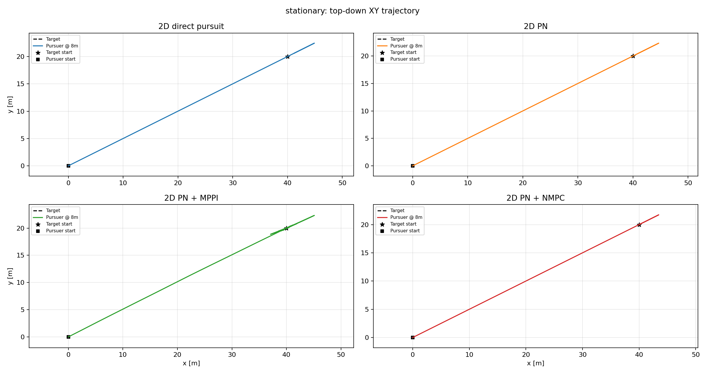

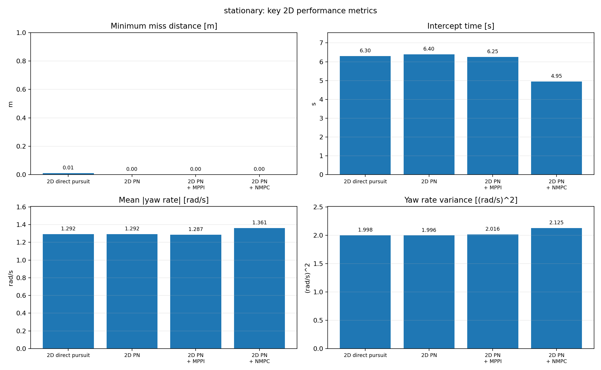

#### 匀速直线目标场景

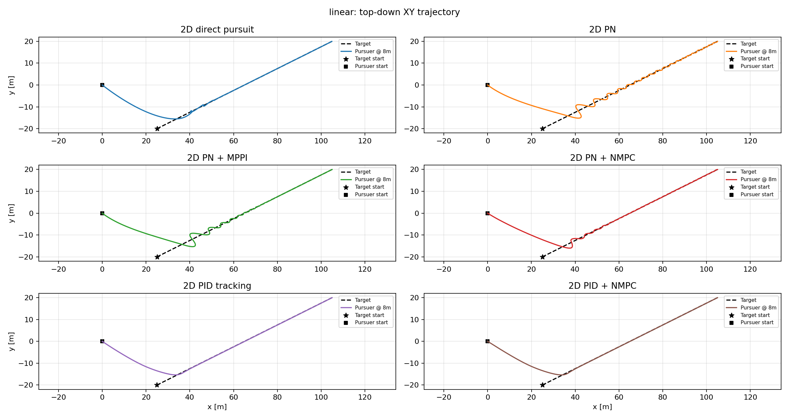

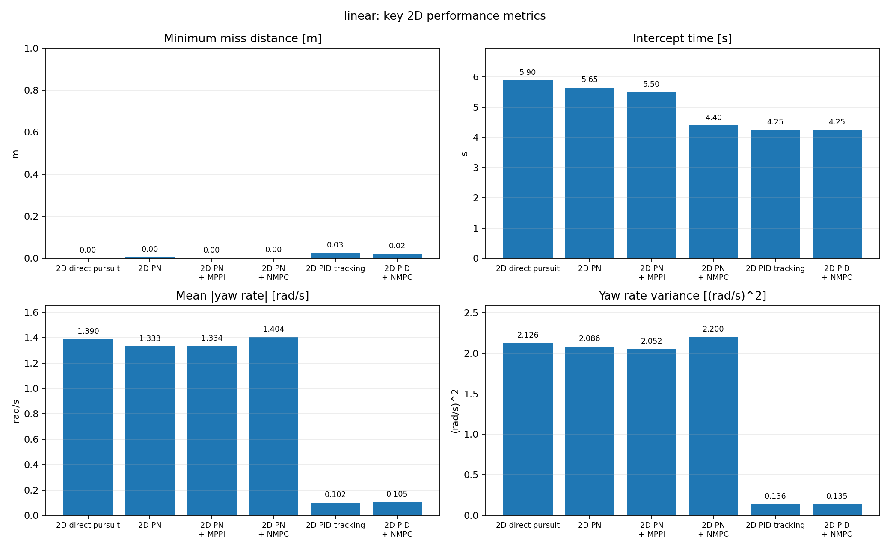

#### 圆周机动目标场景

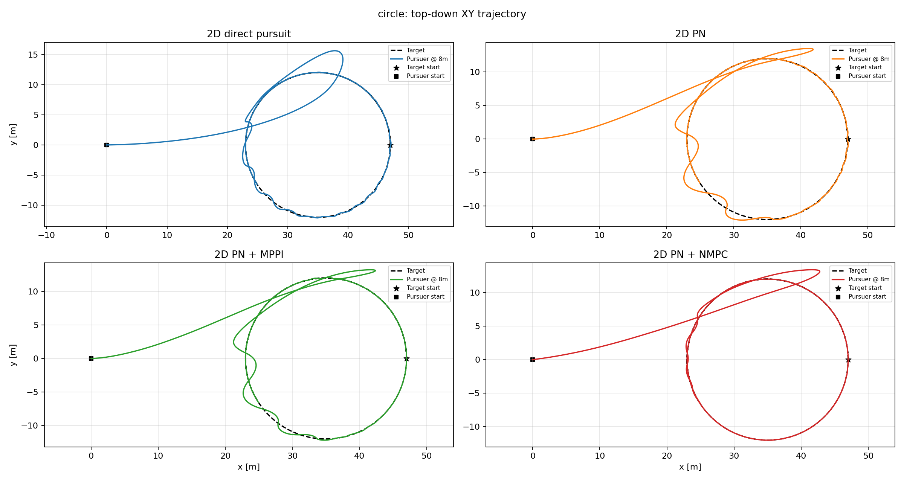

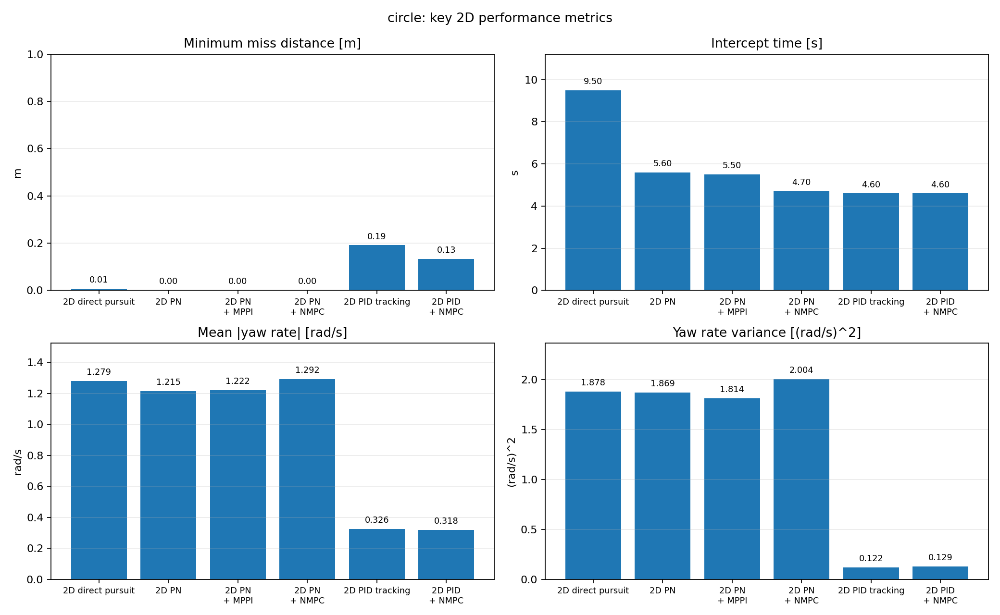

## 11. ROS2/PX4/Gazebo 闭环仿真设计

### 11.1 双机 Offboard 结构

系统包含一架追踪机和一架目标机。目标机按二维合成目标轨迹飞行；追踪机在启动阶段接收 position/velocity hold setpoint，在追踪阶段接收 velocity/acceleration setpoint。两机均由 PX4 SITL 管理底层飞控闭环，ROS2 节点负责：

1. 订阅两机 odometry；
2. 将 PX4 NED 状态转换为 ENU；
3. 启动阶段发布目标机起点 setpoint 和追踪机起飞/保持 setpoint；
4. 检查两机位置与速度是否满足就位阈值；
5. 追踪阶段调用 `compute_guidance()` 计算二维导引加速度；
6. 将限幅后的水平加速度作为 acceleration 前馈发布，并由当前速度积分得到 velocity setpoint；
7. 发布目标机参考轨迹 setpoint、追踪机 yaw setpoint 和必要的 PX4 模式命令；
8. 记录 Gazebo 样本 CSV。

### 11.2 ROS2 话题与 PX4 消息

**订阅**：

- `/<pursuer>/fmu/out/vehicle_odometry`
- `/<target>/fmu/out/vehicle_odometry`

**发布**：

- `/<pursuer>/fmu/in/offboard_control_mode`
- `/<pursuer>/fmu/in/trajectory_setpoint`
- `/<pursuer>/fmu/in/vehicle_command`
- `/<target>/fmu/in/offboard_control_mode`
- `/<target>/fmu/in/trajectory_setpoint`
- `/<target>/fmu/in/vehicle_command`

### 11.3 启动与控制流程

编译并加载 ROS2 包：

```bash
cd 7_2Dsimulation
# 首次从零构建用 --packages-up-to 把 px4_msgs 一并编译，并显式指定系统 Python3
colcon build --packages-up-to gazebosimulation2d \
  --cmake-clean-cache --cmake-args -DPython3_EXECUTABLE=/usr/bin/python3
source install/setup.bash
# install/ 中已有 px4_msgs 后，后续增量编译可改用 --packages-select gazebosimulation2d
```

启动默认 2D 导引节点：

```bash
ros2 launch gazebosimulation2d guidance.launch.py
```

指定算法和场景：

```bash
ros2 launch gazebosimulation2d guidance.launch.py algorithm:=pn_mppi scenario:=circle
```

节点控制流程为：

1. 等待追踪机和目标机均发布有效 `VehicleOdometry`；
2. 计算场景 `t=0` 的目标起点参考，并让目标机发布 position + velocity setpoint；
3. 锁定追踪机起飞/保持点：odometry 模式取准备阶段当前 XY，`target_source=vision` 取场景起点 XY（初始捕获），z 统一改为 `pursuer_fixed_altitude`；
4. 两机持续发布 setpoint，并在 `offboard_warmup_cycles` 后按配置发送 Offboard 和 arm 命令；
5. 使用 `target_start_*_tolerance` 检查目标机是否到达场景起点，使用 `pursuer_takeoff_*_tolerance` 检查追踪机是否到达固定高度起飞点；
6. 两机同时 ready 后，节点重置追踪计时和上一步加速度记忆，开始 2D 追踪与数据记录；
7. 追踪阶段目标机持续发布目标轨迹 position + velocity setpoint；
8. 追踪机每周期读取两机 odometry，调用二维导引算法，发布 velocity + acceleration setpoint，其中 position 字段不启用；
9. 节点退出时保存 `gazebo_samples.csv`。

启动阶段会以 `startup_2d` 低频输出目标机/追踪机的就位误差、速度和命令状态，默认周期为 1 s。追踪阶段可通过 `debug_log:=true` 开启 `debug_2d` 周期日志：

```bash
# `pn_nmpc` 是 EMPC 当前保留的历史代码标识。
ros2 launch gazebosimulation2d guidance.launch.py \
  algorithm:=pn_nmpc \
  scenario:=circle \
  pursuer_fixed_altitude:=8.0 \
  sim_time:=40.0 \
  debug_log:=true
```

`debug_2d` 日志包含：

- `target_odom`：目标机实际 odometry 位置、速度，以及当前代码中固定为零的状态加速度字段；
- `target_cmd`：目标机参考位置、速度、解析轨迹加速度和 yaw setpoint；其中加速度用于诊断显示，实际目标机 setpoint 只启用 position + velocity；
- `pursuer_odom`：追踪机实际 odometry 位置、速度、加速度；
- `pursuer_cmd`：追踪机 velocity + acceleration 控制指令、原始导引加速度和限幅后加速度。

日志周期可通过 launch 参数调整：

```bash
ros2 launch gazebosimulation2d guidance.launch.py debug_log:=true debug_log_period_s:=0.1
```

### 11.4 Gazebo 数据记录与后处理

Gazebo CSV 的基础字段包括：时间、两机位置速度、追踪机实际发布的加速度指令、yaw、`distance_xy` 和 `target_under_table`。`target_source=vision` 时同一份 CSV 还会追加视觉列：`guidance_target_source`、`target_est_x/y`（以及 `target_est_vx/vy`、`target_est_ax/ay`）、`vision_valid`、`vision_age_s`、`vision_latency_s`、`vision_measurements` 和 `vision_error_xy`。**注意 `target_x/target_y` 始终是目标机 odometry 真值**，不是控制器实际消费的量；控制器在视觉模式下用的是 `target_est_*`。正确配置出生点原点参数后，真值与估计值都在公共 ENU 中；未配置原点的历史记录仍含本地原点差。`vision_error_xy` 是视觉估计与目标 odometry 的跨机诊断量，不能作为独立的量测精度标定。

后处理命令示例：

```bash
# 默认导引记录（odometry 基线）
uv run plot_gazebo_csv.py \
  outputs/gazebo2d/circle \
  --output-dir outputs/gazebo2d/circle/total

# 视觉闭环使用独立记录目录时，绘图也单独输出，避免覆盖基线；
# --trajectory-window-s 20 只画前 20 s，圆周轨迹留有缺口（12.3 节插图的口径）
uv run plot_gazebo_csv.py \
  outputs/gazebo2d_vision_runs/circle \
  --output-dir outputs/circle_vision \
  --trajectory-window-s 20

# 视觉链路本身（检出率、像素/位置残差、时延、丢失时段、拒绝原因）
uv run plot_vision_csv.py outputs/gazebo2d_vision --output-dir outputs/vision_report
```

`plot_gazebo_csv.py` 复用离线仿真的指标计算和绘图函数。Gazebo 的 `metrics.png` 以平均水平追踪误差（`mean_distance`）替换捕获时间，适用于所有 Gazebo 追踪场景；纯 Python 的指标图保持捕获时间，CSV 仍保留该列以兼容历史工具。轨迹图由 `pythonsimulation2d/publication_plots.py` 按论文版式画成网格图（`trajectories_2x2.png`，默认画完整记录、`--trajectory-window-s` 可截断），其余面板沿用离线样式。两个口径需要注意：

- **dt**：`plot_gazebo_csv.py` 用**第一个**跑批推断出的单一采样间隔渲染全部算法（`--dt` 可显式覆盖），而记录时间戳存在 ±6 ms 抖动；逐跑批统计控制能量或 yaw rate 时应按跑批各自的中位间隔（或逐样本 Δt 积分）计算，避免不同跑批中位间隔不同时引入偏差（如 2026-10-01 记录为 0.048 / 0.052 s，会让 MPPI/EMPC 这类数值差约 8%）。2026-10-04 复测四个跑批的中位间隔均为 0.050 s，两种口径相差 < 0.2%。
- **捕获时间**：`target_source=vision` 的初始捕获流程会让两机在 t=0 时已落在 1.5 m 捕获半径内，捕获时间恒为 0，评估视觉闭环时应改用最大/平均水平距离。

#### 桌下遮挡场景

新增 `table_occlusion`：目标机以 0.5 m/s 沿 ENU +X 从 `(0,0,1)` 飞至 `(12,0,1)`，在 `(6,0,1)` 停稳后连续悬停 3 秒；速度参考在两段行程的起止处以 0.5 m/s² 加减速。Gazebo 任务依据真实 odometry（位置误差 ≤ 0.15 m、速度 ≤ 0.10 m/s）计时，未停稳或中途失稳就等待/重新计时。桌面长宽 2 × 2 m，下表面离地 2.5 m，具有不透明渲染与碰撞体；四条腿在目标直线路径两侧。世界与完整启动命令见 [模块 README](../README.md#桌下遮挡与重新找回目标)。

使用真实 YOLO 视觉链路和 EMPC（`pn_nmpc`），沿用现有漏检预测、丢失悬停与新量测恢复机制，不增加主动搜索或重获判据。桌下区间按目标实际位置标记，水平误差曲线留空，最小/平均距离排除该区间；出桌后所有距离样本继续绘制与统计，包括还未重获视觉量测的样本。令有效索引集合 $\mathcal{V}$ 为目标不在桌下且距离有限的记录，则平均水平误差为

$$\bar e_{xy}=\frac{1}{|\mathcal{V}|}\sum_{k\in\mathcal{V}}\left\|p_{T,xy}(t_k)-p_{P,xy}(t_k)\right\|_2.$$

两机错开出生点时必须设置 `pursuer_origin_xy` / `target_origin_xy`，导引、视觉量测与指标统一到世界 ENU，位置指令在 ROS 边界转回各机本地 NED；默认零偏移保持旧行为。该新增场景尚未报告真实 Gazebo 闭环结果；纯 Python 同名场景只生成理想目标轨迹。

### 11.5 下视相机与视觉闭环

追踪机下视单目相机（PX4 自带 `x500_mono_cam_down`，airframe 4014）与 YOLO 检测已接入闭环：`ros_gz_bridge` 桥接图像、相机内参和 `/clock`，`vision_detector` 在 conda 常驻 worker 中推理并发布 `/camera/detections`，`vision_adapter` 按图像 stamp 在位姿缓存中插值相机位姿、反投影得到 ENU 下的 `/vision/target_pose`，`guidance_node_2d`（`target_source:=vision`）用 α-β 估计器消费量测、漏检时 coast/hold，不回退 odometry。`vision_source:=truth` 旁路只用于几何与消息链路的自洽检查。

视觉链路统一 `use_sim_time=true`；公共世界系为 ENU，安装外参、反投影、协方差传播与拒绝原因见 [视觉设计参考](vision_design.md)，启动方式、参数表与验收命令见 [模块 README](../README.md#下视相机与视觉闭环)，离线验证与闭环实测记录见 [视觉验证记录](yolo_vision_closed_loop_results.md)。

真实图像外参标定与检测精度门槛评估（`tools/vision_offline_eval.py`）尚未完成，未完成前不报告真实视觉误差指标；标注图、多目标跟踪、TF 与视觉伺服导引不在本轮范围内。

## 12. Gazebo/PX4 视觉闭环仿真结果（40 s 圆周场景）

> 本节数据来自 2026-10-04 的**视觉在环**四算法复测，EMPC 已采用调参后的预测窗口与权重（`horizon_steps = 8`、`nmpc_w_path = 0.5`、`nmpc_w_pn = 1.0`）并开启画面保持（FOV）惩罚（`nmpc_w_fov = 120`）。追踪机只消费 `/vision/target_pose`（下视相机 → YOLO 检测 → 反投影 → α-β 估计），不消费仿真真值：四个跑批 CSV 的 `guidance_target_source` 列全为 `vision`，量测侧统计见 [视觉验证记录](yolo_vision_closed_loop_results.md) 4.1～4.2 节。调参前的 25 s odometry 记录保留在 12.4 节。

### 12.1 数据口径

- 场景：`circle` 圆周机动目标，四种算法各跑一次，每次 40 s；标称 20 Hz 控制与记录频率，每跑批 801 条样本，时间列 0.0～40.0 s；
- 原始记录：`outputs/gazebo2d_vision_runs/circle/<algorithm>/gazebo_samples.csv`（`outputs/` 为生成物、不入库）；
- 指标定义沿用离线仿真的 XY 口径：最小/最大/平均 `distance_xy`、`sum(ax²+ay²)·Δt`、`sum(|Δp_xy|)`、`mean(|wrap(Δyaw)/Δt|)`；
- **Δt 取该跑批时间列的中位采样间隔**：四个跑批均为 0.050 s（记录时间戳存在 ±6 ms 抖动，相邻间隔取值为 0.044/0.048/0.052/0.056 s），控制能量与 yaw rate 两列按此缩放。按逐样本 Δt 积分与中位间隔口径相差 < 0.2%，结论不变；`plot_gazebo_csv.py` 渲染同样的量时使用单一推断 dt，细节见 11.4 节；
- **不报告捕获时间**：`target_source=vision` 的初始捕获流程会把追踪机送到场景起点上方，两机在 t=0 时相距仅 0.06～0.12 m、已经在 1.5 m 捕获半径内，四算法的捕获时间都是 0.00 s、没有区分度，因此改用**最大水平距离**反映全程跟踪质量；
- **跨机距离带常值偏置**：`distance_xy` 由两机各自 PX4 本地系的 odometry 相减得到，两机 spawn 不同点（本次相差 1 m）会让该列整体偏约 1 m。本跑批 `target_est − target_odom` 的 x 分量为 −0.87～−0.95 m（标准差 0.32～0.72 m；均值来自原点差，标准差来自估计滞后与噪声）。控制器消费的是**追踪机本体系**的视觉估计、不受该偏置影响，但本节绝对距离数字必须连同这一口径解读，不能当作量测精度。

### 12.2 圆周目标场景指标

| 算法 | 最小距离/m | 最大距离/m | 控制能量 | 平均距离/m | 路径长度/m | yaw rate mean/rad/s |
| --- | ---: | ---: | ---: | ---: | ---: | ---: |
| 2D direct pursuit | 0.0134 | 7.86 | 1264.97 | 2.70 | 149.90 | 1.620 |
| 2D PN | 0.0536 | 4.16 | 1345.61 | 1.92 | 154.52 | 1.777 |
| 2D PN + MPPI | 0.0285 | 4.74 | 1212.76 | 1.89 | 144.70 | **1.402** |
| **2D PN + EMPC** | 0.0215 | **3.17** | **641.75** | **1.38** | **131.15** | 1.547 |

主要现象：

- **2D PN + EMPC 跟踪精度最好**：最大水平距离 3.17 m、平均距离 1.38 m 均为四者最低，控制能量（641.75）与路径长度（131.15 m）也最低，控制能量约为 MPPI（1212.76）的一半；说明调参后的候选式预测控制在真实 PX4 + 视觉量测的闭环里能稳定贴住机动目标，而不是靠大幅机动换精度；
- **2D PN + MPPI yaw 最平滑**：yaw rate mean（1.402）最低，平均距离 1.89 m、最大距离 4.74 m、控制能量 1212.76 居中；本批没有出现 2026-10-01 记录中的外侧大圈（当时最大距离 13.59 m）；
- **basic 与 PN 精度与能耗都落后**：basic 最大距离 7.86 m、平均 2.70 m，控制能量最高（1264.97）；PN 平均 1.92 m、最大 4.16 m，但控制能量（1345.61）与 yaw rate mean（1.777）都是四者最高，即"一直用力追、精度却不如 EMPC"；
- **量测不连续时闭环仍然稳定**：四个跑批中估计器可用（tracking 或 coast）的控制周期占比为 0.944～0.994；量测从图像 stamp 到被控制周期消费的时延 p50 为 0.10～0.24 s，超过 `vision_max_age_s = 0.5 s` 的量测按过期丢弃，估计器继续 coast、超过 `vision_loss_s = 1.0 s` 才进入 hold，40 s 内没有出现发散或失控。

与第 10 节离线圆周场景相比结论方向一致（EMPC 精度与能耗占优、MPPI yaw 更平滑），但绝对数值不可直接比较：离线从 47 m 外接近目标、统计窗口包含接近段，而视觉闭环在 t=0 时两机已经贴在一起；闭环还要额外承受 PX4 底层控制滞后、setpoint 跟踪误差与量测丢失。

### 12.3 视觉闭环插图

四宫格轨迹图由 `plot_gazebo_csv.py` 直接产出（前 20 s，见 11.4 节命令），复制为 `assets/` 下的插图：

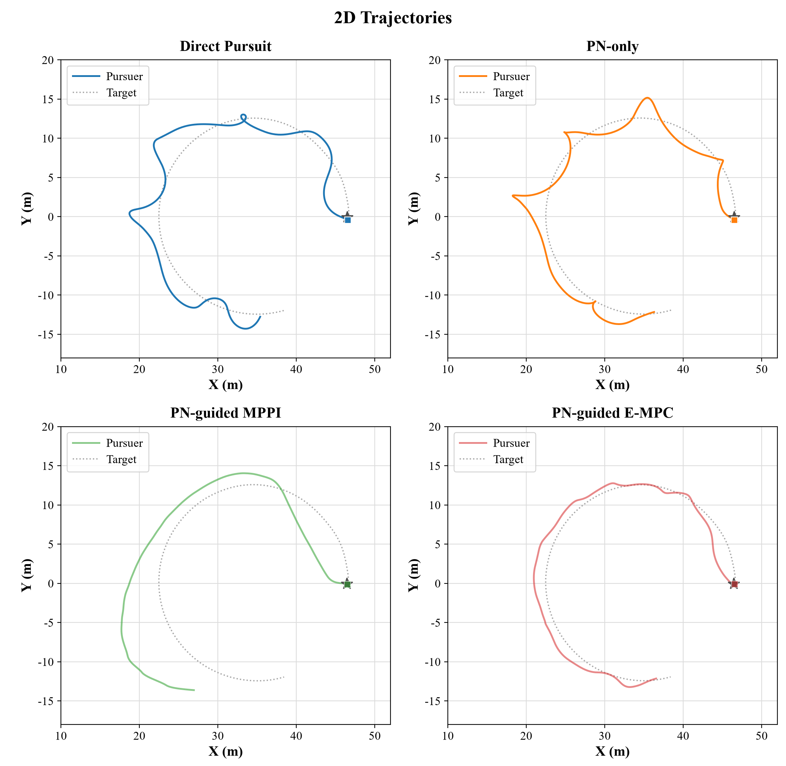

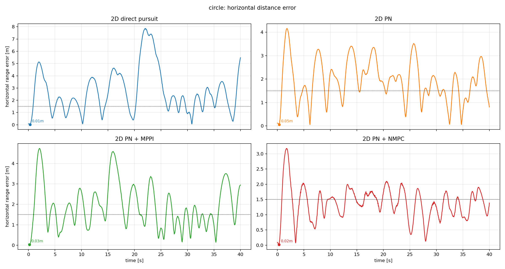

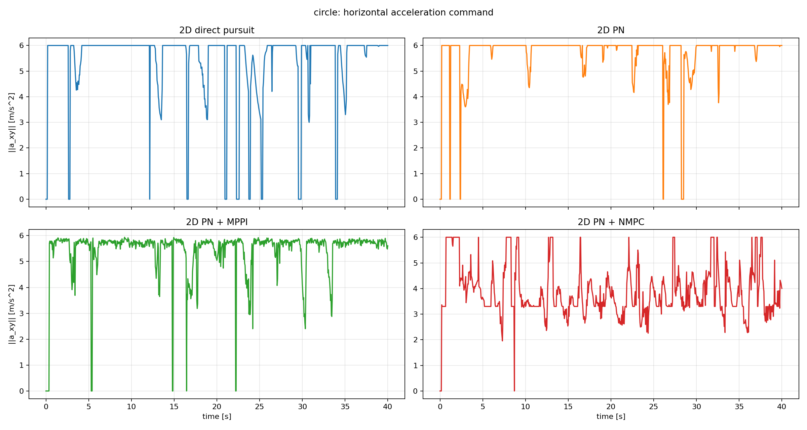

### 12.4 历史参考：调参前的 25 s odometry 闭环记录

> 以下数字来自 EMPC 预测窗口/权重调参**之前**的一次 odometry 闭环记录（25 s 窗口，追踪机直接读目标机 odometry），已被 12.1～12.3 节的视觉闭环结果取代，仅作对照保留；其统计窗口与参数版本都与 12.2 节不同，不可逐项对比。

本节结果来自生成文档时的一次 Gazebo/PX4 圆周闭环记录，当时输出在：

```text
outputs/gazebo2d/circle/
```

`outputs/` 为生成物、不入库；重跑时输出目录由 `record_output_dir` 决定，视觉闭环建议使用 `outputs/gazebo2d_vision_runs`。数据口径如下：

- 场景：`circle` 圆周机动目标；
- 仿真时长：25 s；
- 原始记录：各算法目录下的 `gazebo_samples.csv`；
- 综合指标与对比图：`outputs/gazebo2d/circle/total/`；
- 四个算法的原始 CSV 均包含 502 条样本，时间范围为 0.0 s 到 25.0 s；
- 指标计算沿用离线仿真的 XY 水平距离、捕获半径、控制能量和 yaw rate 统计方式。

| 算法 | 捕获时间/s | 最小距离/m | 控制能量 | 平均距离/m | 路径长度/m | yaw rate mean/rad/s | yaw rate variance |
| --- | ---: | ---: | ---: | ---: | ---: | ---: | ---: |
| 2D direct pursuit | 10.90 | 0.0370 | 648.97 | 8.89 | 113.42 | 1.415 | 1.896 |
| 2D PN | 6.15 | **0.0074** | 603.17 | 8.95 | 112.34 | 1.362 | 3.138 |
| **2D PN + MPPI** | **5.90** | 0.0197 | 250.27 | 7.83 | 101.60 | 0.822 | 1.312 |
| 2D PN + EMPC | 6.00 | 0.0781 | **174.84** | **7.82** | **96.54** | **0.340** | **0.399** |

在 25 s Gazebo 圆周目标闭环仿真中，四种算法均完成 XY 捕获，主要现象为：

- **2D direct pursuit** 捕获时间最长，控制能量和 yaw rate mean 也较高，体现出追赶式轨迹在机动目标下效率较低；
- **2D PN** 最小距离最低，说明其比例导引几何在闭环 PX4 环境中仍能形成有效拦截，但控制能量和 yaw rate 方差较高；
- **2D PN + MPPI** 捕获时间最短，同时相对 basic/PN 明显降低控制能量和 yaw 转向强度；
- **2D PN + EMPC** 捕获时间略慢于 MPPI，但控制能量、平均距离、路径长度、yaw rate mean 和 yaw rate 方差均为当前 Gazebo 输出中最优，表现出更偏向低能耗和平滑跟踪的取舍。

这些 Gazebo 结果与离线圆周场景的总体趋势一致：MPPI 更激进、捕获更快；EMPC 更平滑、更省控制，但在最小距离或首次捕获时间上不一定最优。需要注意，该记录同时受到调参前的 EMPC/MPPI 参数、PX4 底层控制、机体模型、setpoint 跟踪误差和 25 s 统计窗口影响，因此不应与 40 s 离线质点仿真或 12.2 节的视觉闭环结果逐项对比。

以下插图同样来自那次调参前的记录（`outputs/gazebo2d/circle/total/`），保留作历史对照：
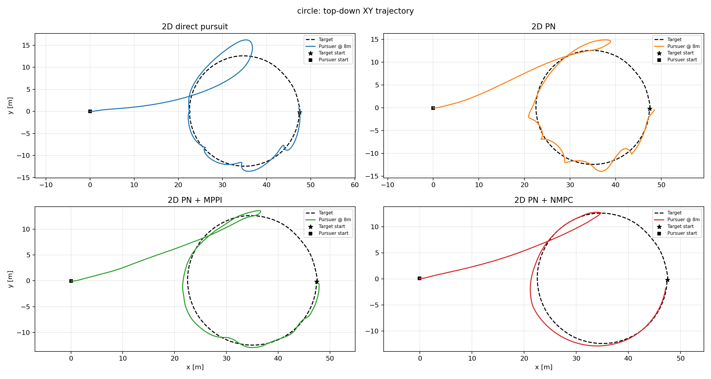

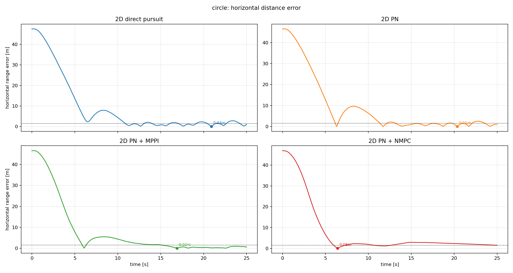

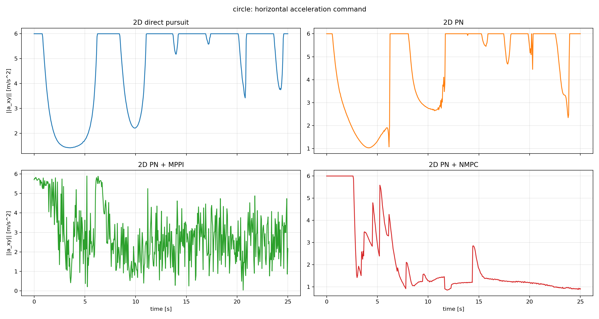

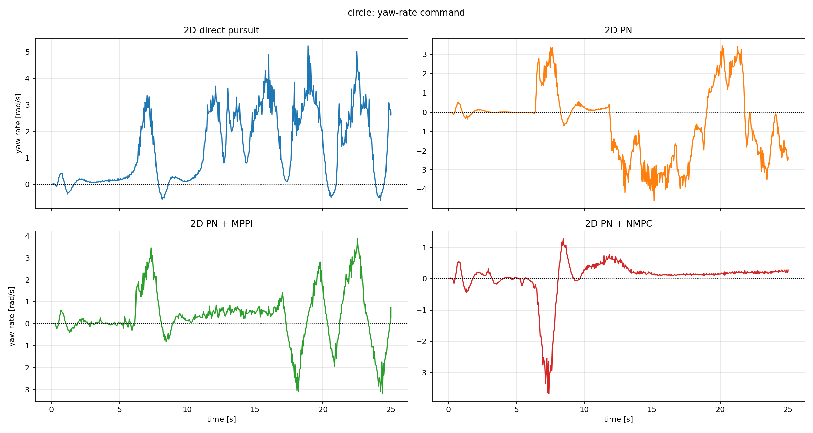

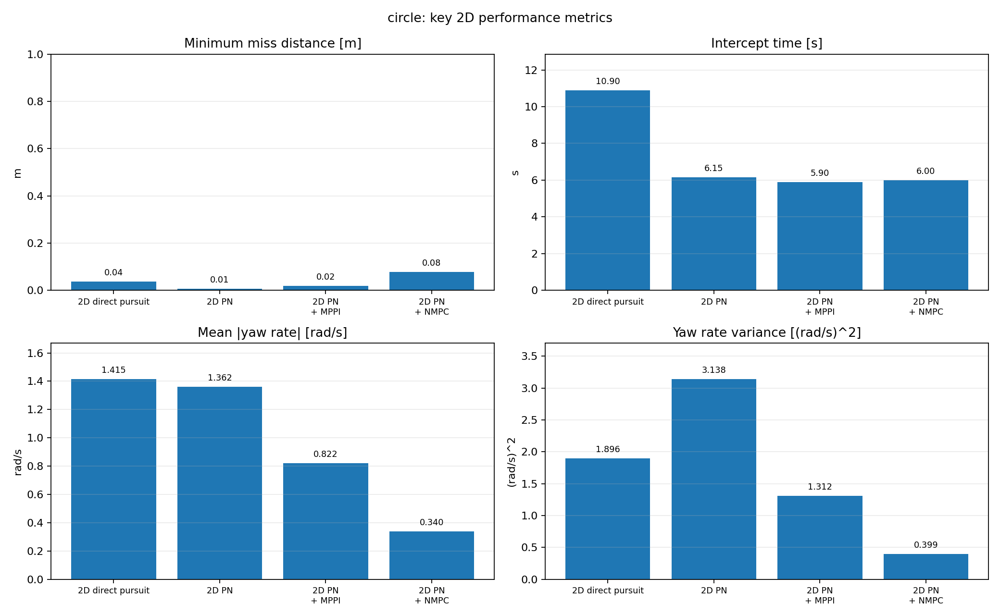

### 12.5 EMPC 画面保持（FOV）惩罚的受控对比（2026-10-04）

> 在同一套 Gazebo + YOLO 视觉闭环（`pn_nmpc`、circle、40 s、无阴影世界、两机 spawn `48,0` / `47,0`）下先后跑 `nmpc_w_fov=0`（无 FOV）与 `nmpc_w_fov=120`（soft=0.5、cap=3.0，有 FOV）：两轮使用同一启动命令与同一 PX4/Gazebo 实例，跟踪均在两机于场景起点就位后开始，中间只切换该权重。原始记录分别在 `outputs/gazebo2d_vision_runs_nofov/` 与 `outputs/gazebo2d_vision_runs_fov/`（已不在当前 `outputs/` 中）；12.2 节的 EMPC 行来自 2026-10-04 四算法复测的 `outputs/gazebo2d_vision_runs/circle/pn_nmpc/gazebo_samples.csv`，与本节的受控对比不是同一批数据。

画面偏移按两机 odometry 真值与 spawn 原点差（−1, 0）修正后计算，取归一化 max 范数，±1 为画面边缘，定义与 7.3.1 节一致；指标按 12.1 节口径用每轮时间列的中位间隔（0.050 / 0.052 s）缩放。

| 指标 | w=0（无 FOV） | w=120（有 FOV） |
| --- | ---: | ---: |
| 最小 / 最大水平距离/m | 0.060 / 3.15 | 0.033 / 2.47 |
| 平均水平距离/m | 1.404 | 1.434 |
| 路径长度/m | 131.67 | 134.18 |
| 控制能量 | 658.4 | 697.2 |
| yaw rate mean / variance | 1.528 / 3.076 | 1.322 / 2.537 |
| 真值画面偏移 max / mean / p95 | 0.287 / 0.106 / 0.224 | 0.360 / 0.115 / 0.251 |
| 偏移 > 0.85 占比 | 0 | 0 |
| 估计器可用（tracking/coast）占比 | 0.998 | 0.993 |
| 最长量测间隔（0–40 s） | 1.00 s | 0.90 s |

结论：

- 追踪精度基本一致：平均距离 1.404 vs 1.434 m（差 2%）、最大距离 3.15 vs 2.47 m；两轮画面偏移都远小于安全边界 0.85。在 EMPC 的跟踪误差范围内 circle 默认机动不会让目标压边，FOV 项在此工况是"压边保险"而不是主控制器。
- 有 FOV 轮控制略更积极：控制能量 +5.9%、路径 +1.9%，同时 yaw rate mean 低 13.5%、方差低 17.5%；差异量级与单次跑批的正常波动相当。
- 离线受控对比（第 10 节口径，同场景同初始条件）结论同量级：三种场景捕获时间缩短 0.15～0.25 s，控制能量变化 ≤ 5%，画面保持统计不劣化（圆周场景捕获后 max|offset| 1.09 → 1.18，属同一量级）。
- 惩罚的"有效作用"由一次 799 周期的反事实回放确认：重放 `nmpc_w_fov=120` 的指令与记录逐位一致；把权重置 0 后 20 个周期选择了不同候选（最大加速度差 2.6 m/s²），且差异全部出现在预测偏移超过软边界的周期——即它在"即将压边"时提前回中，而不是持续偏置控制。

对照：2026-10-01 记录中未加 FOV 项的 `pn_mppi` 真值偏移 max = 1.83、42.5% 的时间超过 0.85，说明画面边缘/出画风险在预测控制器中真实存在；按项目决定，本轮只对 `pn_nmpc` 生效。2026-10-04 四算法复测（同口径，spawn 原点差按（−1, 0）修正）中真值画面偏移 max 分别为 basic 1.33 / pn 0.60 / pn_mppi 0.65 / pn_nmpc 0.45，只有跟踪最差的 basic 有 7.1% 的时间超过 0.85；画面偏移与跟踪误差同向：basic 跟踪最差、偏移最大，pn_nmpc 跟踪最好、偏移最小。

## 13. 仿真假设与局限性

- 当前模型是二维定高俯瞰追踪，不能反映完整三维机动、爬升下降或姿态动力学。
- 追踪机和目标虽然保存 `[x, y, z]` 状态，但导引与指标只使用 XY 分量。
- 当前导引不建模深度相机、遮挡、误检漏检和目标丢失预测的完整统计模型；EMPC 的 FOV 项只是图像平面的软性画面保持惩罚，不模拟出画后的可见性、也不提供重捕获，`target_source:=vision` 仍依赖 YOLO 量测、α-β 估计与 coast/hold 兜底，检测精度与丢失行为以闭环实测数据为准。
- yaw 只表示水平机头朝向，不包含完整 roll/pitch/yaw 姿态动力学。
- 离线仿真采用质点模型，Gazebo 结果会受到 PX4 底层控制器、机体模型、setpoint 跟踪误差和通信频率影响。
- 当前 Gazebo 追踪阶段不再通过 position setpoint 强制拉住追踪机高度，而是发布 z 速度和 z 加速度为 0 的 velocity + acceleration setpoint；实际高度保持效果取决于 PX4 底层控制器与机体响应。
- MPPI 与 EMPC 的结果依赖预测窗口、权重、候选集合、采样数、噪声尺度和温度参数；本文只报告调参后的这一组参数，未做窗口/权重的敏感性扫描。
- 目标运动只覆盖静止、匀速直线与匀速圆周三类，**不包含急转、换向、加减速等高 jerk 机动**；在高机动场景下的结论尚未验证。
- 视觉闭环的检测来自渲染图像、目标按解析轨迹运动，未建模运动模糊、光照变化与背景杂波；跨机距离列还带两机本地系原点差（见 12.1 节），因此视觉闭环的距离指标只能在同一口径内横向比较。
- 两机在视觉闭环中的初始条件（起飞就位方式、spawn 间隔）会影响早期几秒的误差，比较不同跑批时应先确认这两项一致。

## 14. 章节推荐结构

如果将本部分写入论文或报告，可采用以下章节结构：

```text
X 二维定高追踪仿真与结果分析
X.1 仿真平台与总体框架
X.2 二维定高运动模型与目标场景
X.3 对比算法与预测控制框架
  X.3.1 基础追踪算法
  X.3.2 二维比例导引算法
  X.3.3 PN + MPPI 采样预测控制
  X.3.4 PN + EMPC 候选式预测控制
  X.3.5 单环 PID 与 PID + EMPC 混合
X.4 评价指标与实验设置
X.5 离线数值仿真结果与分析
  X.5.1 静止目标场景
  X.5.2 匀速直线目标场景
  X.5.3 圆周机动目标场景
  X.5.4 综合分析
X.6 PX4/Gazebo 二维闭环仿真设计
  X.6.1 视觉量测链路与视觉—控制映射
X.7 Gazebo/PX4 闭环仿真结果
  X.7.1 视觉在环闭环结果（40 s 圆周）
  X.7.2 调参前的 odometry 对照记录（可选）
X.8 仿真结论与局限性
```
